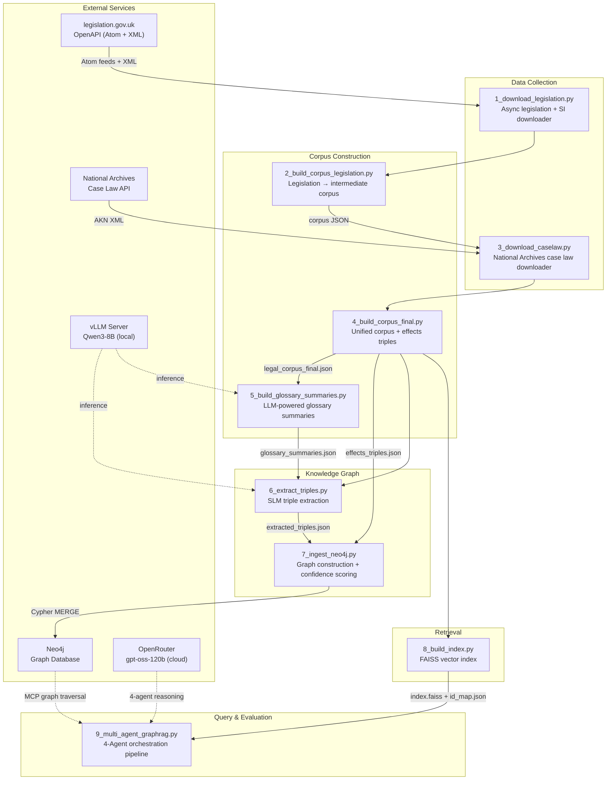
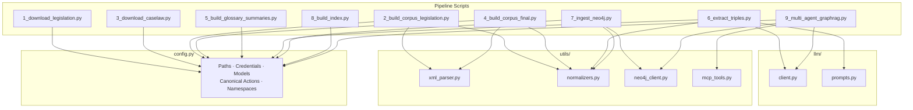
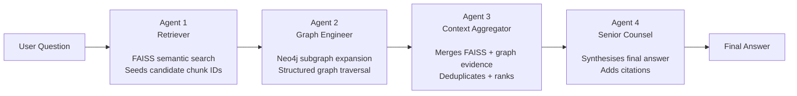

# LegalKGent — Technical Architecture

> This document covers the internal design of every pipeline component: data flow, module responsibilities, knowledge graph schema, agent specifications, and evaluation methodology.

---

## Table of Contents

1. [System Overview](#1-system-overview)
2. [Data Collection](#2-data-collection)
3. [Corpus Construction](#3-corpus-construction)
4. [Knowledge Graph Construction](#4-knowledge-graph-construction)
5. [Vector Index](#5-vector-index)
6. [Multi-Agent Query Pipeline](#6-multi-agent-query-pipeline)
7. [Evaluation](#7-evaluation)
8. [Module Reference](#8-module-reference)
9. [Configuration Reference](#9-configuration-reference)

---

## 1. System Overview

### End-to-End Pipeline



### Module Dependency Map



---

## 2. Data Collection

### 2.1 Legislation Download (`1_download_legislation.py`)

Discovers and downloads UK primary legislation, statutory instruments, and amendment effects feeds using three layered discovery strategies:

| Strategy | Method | Target |
|----------|--------|--------|
| Subject-based | Atom feed pagination by subject category | Transport, Criminal Justice, Energy & Environment |
| Title keyword | Search feed filtered by keyword | Acts matching `TITLE_KEYWORDS` list |
| Year enumeration | Iterate known Act titles across years | `SEED_ACTS` enumerated 1980–2024 |

**Key classes and functions:**

- `URIRegistry` — deduplicated in-memory store for discovered legislation URIs; persists across discovery passes to avoid re-fetching
- `parse_atom_feed(xml_bytes)` — extracts `<entry>` hrefs and `<link rel="next">` pagination from Atom XML
- `build_session()` — `requests.Session` with retry policy (`MAX_RETRIES=3`) and rate-limiting (`DOWNLOAD_RATE_LIMIT_WAIT=0.2s`)
- `discover_by_subject()` / `discover_by_title()` / `discover_by_year_enum()` — three independent discovery passes feeding into URIRegistry
- `download_legislation()` — fetches `/data.xml` for each URI; skips existing files
- `download_effects()` — fetches effects feed XML for each Act (used as ground-truth amendments)
- `save_manifest()` — records download counts and timestamps to `data/download_manifest.json`

### 2.2 Case Law Download (`3_download_caselaw.py`)

**Dependency:** Requires `data/legal_corpus_final.json` from Step 2a. Reads every unique legislation title from the corpus and uses each as an exact-match query against the National Archives search feed.

**Coverage:** UKSC, EWCA, EWHC, UKUT, UKFTT, EAT, EWFC courts.

**Key functions:**

- `generate_queries(corpus_path)` — extracts unique `title` values from corpus JSON as search strings
- `search_caselaw(session, query)` — queries `https://caselaw.nationalarchives.gov.uk/search?query=...` Atom feed
- `find_all_judgment_links(session, query)` — paginates search results to collect all judgment URLs
- `download_judgments(session, urls)` — fetches AKN XML for each judgment; skips existing files

---

## 3. Corpus Construction

### 3.1 XML Parsing (`utils/xml_parser.py`)

Handles two distinct XML dialects:

**CLML (Crown Legislation Markup Language)** — UK primary legislation and statutory instruments:

- `CLMLParser` — recursive walker for `<Part>` → `<Chapter>` → `<Section>` → `<Subsection>` → `<Paragraph>` hierarchy
- `_extract_defined_terms()` — locates `<Term>` elements and builds `defined_terms: dict[str, str]`
- `_process_section()` — extracts section text, cross-references, block amendments, and commentary refs
- Produces corpus chunks with fields: `id`, `title`, `act_title`, `type`, `text`, `section_refs`, `defined_terms`

**AKN (Akoma Ntoso)** — court judgment XML:

- `parse_caselaw_xml()` — extracts judgment header metadata (court, date, parties), body paragraphs, and opinion text
- `_ref_to_section_id()` — maps `<ref>` `href` attributes to corpus chunk IDs
- Produces chunks typed as `caselaw` with `court`, `date`, `parties` fields

**Effects parsing:**

- `parse_effects_xml()` — parses amendment effects feed into ground-truth `(subject, action, object)` triples
- `_map_effect_type()` — normalises raw effect type strings to canonical action types
- `load_effects_triples()` — loads all effects JSON from `data/amendments/` directory

**Corpus assembly:**

- `build_smart_corpus()` — unified builder that runs all three parsers and merges outputs into `legal_corpus_final.json`

### 3.2 Corpus Structure

Each corpus chunk is a JSON object:

```json
{
  "id": "road_traffic_act_1988_s1",
  "act_title": "Road Traffic Act 1988",
  "title": "Section 1 — Causing death by dangerous driving",
  "type": "legislation",
  "text": "A person who causes the death of another person...",
  "section_refs": ["road_traffic_act_1988_s2"],
  "defined_terms": {"dangerous driving": "driving that falls far below..."}
}
```

Case law chunks additionally carry: `court`, `date`, `parties`, `cited_legislation`.

### 3.3 Normalisation (`utils/normalizers.py`)

- `normalize_action(raw)` — maps 80+ verb variations to 19 canonical action types via `ACTION_NORMALIZER` dict
- `normalize_citation(text)` — standardises Act citations (expands abbreviations, normalises year formats)
- `extract_act_name(text)` — regex extraction of Act title from free text
- `build_abbreviation_table(corpus)` — auto-extracts abbreviation definitions from corpus text
- `build_id_to_title_map(corpus)` — builds `chunk_id → title` lookup for graph display

### 3.4 Glossary Summarisation (`5_build_glossary_summaries.py`)

Iterates all `defined_terms` across the corpus and calls vLLM (Qwen2.5-3B-Instruct) to produce a one-sentence plain-English summary per term. Results are checkpointed to `data/glossary_summaries.json` so interrupted runs resume without re-processing. Uses `ThreadPoolExecutor` with `NUM_WORKERS=4`.

---

## 4. Knowledge Graph Construction

### 4.1 Triple Extraction (`6_extract_triples.py`)

Sends each corpus chunk to a local vLLM server with a structured prompt that injects the relevant glossary definitions. The model is prompted to return a JSON array of triples:

```json
[
  {
    "subject": "Road Traffic Act 1988",
    "action": "AMENDS",
    "object": "Road Traffic Regulation Act 1984",
    "confidence": 0.9,
    "source_chunk": "road_traffic_act_1988_s1"
  }
]
```

**Prompts** (`llm/prompts.py`):

- `LEGISLATION_PROMPT` — extraction rules, the 19 canonical action types, and JSON schema for legislation chunks
- `CASELAW_PROMPT` — judicial action types (`OVERRULES`, `AFFIRMS`, `INTERPRETS`, `CITES`) and citation rules for case law chunks

**Processing:**

- Batched with `ThreadPoolExecutor(NUM_WORKERS=4)` across chunks
- Checkpoints every `SAVE_EVERY=20` batches to survive interruption
- `post_process()` validates and normalises all extracted triples
- `print_quality_report()` logs extraction yield, confidence distribution, and action type breakdown

### 4.2 The 19 Canonical Actions

| Category | Types |
|----------|-------|
| Legislative modification | `AMENDS`, `REPEALS`, `SUBSTITUTES`, `INSERTS`, `COMMENCES`, `REVOKES` |
| Relational | `APPLIES`, `CITES`, `OVERRULES`, `DELEGATES`, `IMPLEMENTS` |
| Semantic | `DEFINES`, `INTERPRETS` |
| Power & obligation | `CREATES`, `EMPOWERS`, `REQUIRES`, `PROHIBITS`, `EXTENDS` |
| Judicial | `AFFIRMS` |

### 4.3 Neo4j Ingestion (`7_ingest_neo4j.py`)

**Graph schema:**

```
(:LegalDoc {id, title, act_title, type, text, court?, date?})
    -[:LEGAL_RELATIONSHIP {action, confidence, source_chunk, count}]->
(:LegalDoc)

(:LegalDoc)-[:LEGAL_RELATIONSHIP {action:"DEFINES"}]->(:Concept {name, description})
(:LegalDoc)-[:IN_ACT]->(:LegalDoc {type:"act_header"})
(:LegalDoc)-[:HAS_SECTION]->(:LegalDoc)
```

**Confidence accumulation:** When the same `(subject, action, object)` triple is encountered multiple times (from different source chunks), `ingest_triples()` uses Cypher `MERGE` and increments the edge `count` and averages `confidence`. High-count edges represent strongly evidenced relationships.

**Functions:**

- `load_all_triples()` — merges legislation and case law triple files with deduplication
- `load_corpus_lookup()` — builds id→metadata dict for node enrichment
- `ingest_triples()` — MERGE `:LegalDoc` nodes, CREATE `:LEGAL_RELATIONSHIP` edges
- `create_concept_nodes()` — creates `:Concept` nodes from glossary terms
- `ingest_graph_edges()` — creates deterministic structural edges (`:IN_ACT`, `:HAS_SECTION`, `:CITES`)
- `verify_graph()` — logs node counts, edge counts, and relationship type distribution

---

## 5. Vector Index

### `8_build_index.py`

Encodes every corpus chunk's `text` field using `sentence-transformers/all-MiniLM-L6-v2` (384-dimensional embeddings, batch size 200, max token length 512). Builds a FAISS `IndexFlatIP` (inner product = cosine similarity on normalised vectors).

Outputs:
- `data/faiss_index/index.faiss` — the FAISS index binary
- `data/faiss_index/id_map.json` — `{faiss_integer_id → corpus_chunk_id}` mapping

`MIN_SIM_THRESHOLD = 0.25` — queries returning similarity below this threshold are treated as no-match.

---

## 6. Multi-Agent Query Pipeline

### 6.1 Agent Architecture

The pipeline chains four agents sequentially. Each agent's output becomes the next agent's input context. Agents communicate through a shared `PipelineState` dict.



### 6.2 MCP Tool Registry (`utils/mcp_tools.py`)

Each agent has access only to its designated tool set. The `AGENT_TOOL_REGISTRY` enforces this. All tools execute in a read-only sandbox (`_is_write_query()` blocks any Cypher mutation).

| Tool | Available to | Description |
|------|-------------|-------------|
| `mcp_semantic_search(query, k)` | Agent 1 | FAISS cosine search, returns top-k chunk IDs + scores |
| `mcp_get_schema()` | Agent 2 | Returns Neo4j node labels, relationship types, and property keys |
| `mcp_search_nodes_by_title(title)` | Agent 2 | Title/citation keyword search on `:LegalDoc` nodes |
| `mcp_execute_cypher(query)` | Agent 2 | Runs arbitrary read-only Cypher (write ops blocked) |
| `mcp_get_node_subgraph(node_id, depth)` | Agent 2 | BFS subgraph expansion from a seed node |
| `mcp_find_relationships(node_id, action?)` | Agent 2 | All edges in/out of a node, optionally filtered by action type |
| `mcp_find_case_interpretations(act_id)` | Agent 2 | Case law nodes that cite or interpret a given Act |
| `mcp_find_amendments_timeline(act_title)` | Agent 2 | Chronological amendment history for an Act |
| `mcp_read_document_text(chunk_id)` | Agent 3 | Returns raw corpus text for a given chunk ID |
| `mcp_submit_final_answer(answer)` | Agent 4 | Writes the final answer string to pipeline state |

### 6.3 Agent Specifications

**Agent 1 — Retriever**

- Input: raw user question
- Generates 3–5 semantic reformulations of the question
- Runs `mcp_semantic_search` for each reformulation, collects top-k results
- Deduplicates seed node IDs by score
- Output: ranked list of FAISS seed chunk IDs + similarity scores

**Agent 2 — Graph Engineer**

- Input: Agent 1's seed chunk IDs
- For each seed: calls `mcp_get_node_subgraph` then selects relevant traversal tools based on node type
- Expands legislation seeds with `mcp_find_amendments_timeline` and `mcp_find_relationships`
- Expands case law seeds with `mcp_find_case_interpretations`
- Uses `mcp_execute_cypher` for complex multi-hop queries
- Output: JSON edge list + node metadata (discovered subgraph)

**Agent 3 — Context Aggregator**

- Input: Agent 1 FAISS results + Agent 2 graph discoveries
- Calls `mcp_read_document_text` for each confirmed node ID to retrieve raw corpus text
- Merges retrieved text passages with the structured graph context from Agent 2
- Deduplicates overlapping evidence, ranks by relevance to the original question
- Output: consolidated evidence package (text + graph) ready for synthesis

**Agent 4 — Senior Counsel**

- Input: Agent 3's consolidated evidence
- Synthesises a complete, grounded answer in plain English
- Calls `mcp_submit_final_answer(answer)` to commit the final answer string
- Output: final answer string with inline citations

### 6.4 LLM Client (`llm/client.py`)

- `get_vllm_client()` — returns OpenAI-compatible client pointed at local vLLM server (`VLLM_BASE_URL`)
- `get_query_client()` — returns OpenAI-compatible client pointed at OpenRouter (`QUERY_MODEL = "openai/gpt-oss-120b:free"`)
- `parse_llm_json(response)` — robust parser that handles markdown fences, truncation, and partial JSON from LLM outputs

---

## 7. Evaluation

Evaluation is run via `10_evaluate.py` (not included in main pipeline — run separately).

**Methodology:**

A fixed set of `TEST_QUESTIONS` with known expected `actions` is run through the full 4-agent pipeline. Each answer is scored on three dimensions:

| Metric | Description |
|--------|-------------|
| `has_answer` | Response contains a substantive answer (non-empty, >50 tokens) |
| `has_grounding` | Response includes at least one Act or section citation |
| `actions_found` | Fraction of expected canonical actions mentioned in the answer |

A Judge LLM call (same cloud model) scores `has_answer` and `has_grounding` for borderline cases. Final accuracy is the mean of all three metrics across all test questions.

**Baseline comparison:** The same test questions are posed directly to the query LLM without graph context, establishing a no-RAG baseline.

---

## 8. Module Reference

| Module | Path | Responsibility |
|--------|------|----------------|
| Configuration | `config.py` | All paths, credentials, model names, canonical constants |
| Legislation downloader | `1_download_legislation.py` | Atom feed pagination, HTTP download, manifest |
| Corpus (legislation) | `2_build_corpus_legislation.py` | Intermediate legislation-only corpus |
| Case law downloader | `3_download_caselaw.py` | National Archives API search + download |
| Corpus (final) | `4_build_corpus_final.py` | Unified corpus merge + effects triples |
| Glossary summariser | `5_build_glossary_summaries.py` | vLLM term summarisation with checkpointing |
| Triple extractor | `6_extract_triples.py` | Batched vLLM extraction with ThreadPoolExecutor |
| Neo4j ingestor | `7_ingest_neo4j.py` | Graph build, confidence accumulation, concept nodes |
| Index builder | `8_build_index.py` | FAISS IndexFlatIP from sentence-transformer embeddings |
| Multi-agent pipeline | `9_multi_agent_graphrag.py` | 4-agent orchestration, lazy LLM init, pipeline state |
| XML parser | `utils/xml_parser.py` | CLML, AKN, effects, notes parsers |
| Normalizers | `utils/normalizers.py` | Action/citation normalisation, abbreviation expansion |
| Neo4j client | `utils/neo4j_client.py` | Driver wrapper, schema queries, index management |
| MCP tools | `utils/mcp_tools.py` | Sandboxed tool catalogue for all four agents |
| LLM clients | `llm/client.py` | vLLM + cloud client wrappers, JSON parsing |
| Extraction prompts | `llm/prompts.py` | Legislation and case law extraction system prompts |

---

## 9. Configuration Reference

All values are read from `config.py`. Environment variables override defaults.

### Data Paths

| Variable | Default | Description |
|----------|---------|-------------|
| `DATA_DIR` | `data` | Root data directory |
| `RAW_LEGISLATION_DIR` | `data/raw_legislation` | Downloaded legislation XML |
| `RAW_SI_DIR` | `data/raw_statutory_instruments` | Downloaded SI XML |
| `RAW_CASELAW_DIR` | `data/raw_caselaw` | Downloaded judgment XML |
| `AMENDMENTS_DIR` | `data/amendments` | Downloaded effects feed XML |
| `CORPUS_FILE` | `data/legal_corpus_final.json` | Unified corpus |
| `TRIPLES_FILE` | `data/extracted_triples.json` | Extracted legislation triples |
| `INDEX_FILE` | `data/faiss_index/index.faiss` | FAISS binary |
| `IDMAP_FILE` | `data/faiss_index/id_map.json` | FAISS integer → chunk ID map |

### Models

| Variable | Default | Description |
|----------|---------|-------------|
| `VLLM_MODEL` | `Qwen/Qwen3-8B` | Local SLM for triple extraction |
| `GLOSSARY_MODEL` | `Qwen/Qwen2.5-3B-Instruct` | Local SLM for glossary summarisation |
| `QUERY_MODEL` | `openai/gpt-oss-120b:free` | Cloud LLM for 4-agent pipeline (via OpenRouter) |
| `EMBED_MODEL` | `all-MiniLM-L6-v2` | Sentence transformer for FAISS |
| `EMBED_DIM` | `384` | Embedding dimensionality |

### Processing

| Variable | Default | Description |
|----------|---------|-------------|
| `NUM_WORKERS` | `4` | ThreadPoolExecutor workers |
| `BATCH_SIZE` | `5000` | Max chunks per extraction run |
| `SAVE_EVERY` | `20` | Checkpoint interval (batches) |
| `MAX_RETRIES` | `3` | Per-chunk retry limit |
| `VLLM_TIMEOUT` | `300` | Seconds per vLLM request |
| `MIN_SIM_THRESHOLD` | `0.25` | Minimum FAISS cosine similarity |
| `MAX_PAGES_PER_FEED` | `300` | Safety cap on Atom feed pagination |
