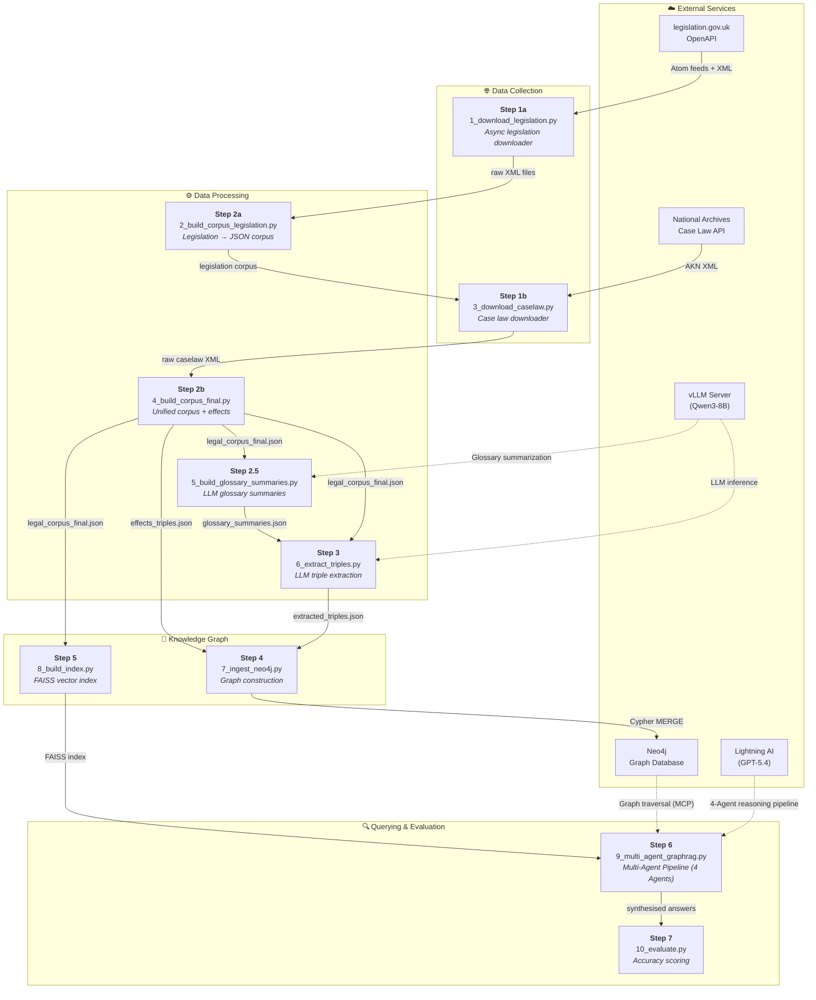
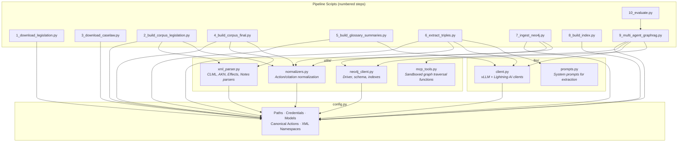
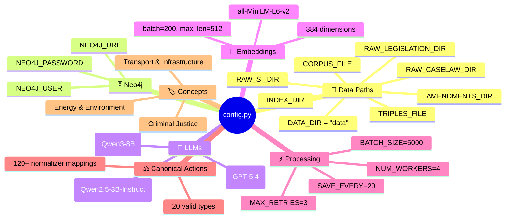

# LegalKGent — Pipeline Overview & Architecture

> A 9-step GraphRAG pipeline that builds a UK Legal Knowledge Graph from raw legislation XML and provides a hybrid query agent.

---

## High-Level Architecture



---

## Module Dependency Map



---

## File Map

| File | Location | Purpose |
|------|----------|---------|
| `config.py` | Root | Centralised configuration — paths, credentials, models, canonical actions |
| `1_download_legislation.py` | Root | Async parallel downloader for UK legislation & SI XML |
| `3_download_caselaw.py` | Root | Case law downloader from National Archives API |
| `2_build_corpus_legislation.py` | Root | Parses legislation/SI XML into intermediate corpus |
| `4_build_corpus_final.py` | Root | Builds unified corpus (legislation + caselaw) + effects triples |
| `5_build_glossary_summaries.py` | Root | LLM-powered glossary term summarization |
| `6_extract_triples.py` | Root | LLM-based knowledge triple extraction with checkpointing |
| `7_ingest_neo4j.py` | Root | Ingests triples into Neo4j with confidence accumulation |
| `8_build_index.py` | Root | Builds FAISS vector index from corpus embeddings |
| `6_query_agent.py` | Root | *(Deprecated)* Legacy GraphRAG ReAct agent |
| `9_multi_agent_graphrag.py` | Root | Standardised 4-Agent Orchestration (Retriever, Graph Engineer, Context Aggregator, Senior Counsel) |
| `10_evaluate.py` | Root | Runs test questions and scores agent accuracy |
| `validate.py` | Root | Combined validation script for corpus, triples, and graph |
| `utils/xml_parser.py` | utils/ | All XML parsers — legislation, case law, effects, notes |
| `utils/normalizers.py` | utils/ | Action & citation normalization, abbreviation expansion |
| `utils/neo4j_client.py` | utils/ | Neo4j connection management and schema queries |
| `utils/mcp_tools.py` | utils/ | Tool catalogue for Graph Engineer / Aggregator containing sandboxed Cypher macros |
| `llm/client.py` | llm/ | LLM client wrappers (vLLM + Lightning AI) and JSON parsing |
| `llm/prompts.py` | llm/ | System prompts for triple extraction |

---

## Configuration — `config.py`

### Key Configuration Sections



### The 20 Canonical Actions

| Category | Actions |
|----------|---------|
| **Legislative Modification** | `AMENDS`, `REPEALS`, `SUBSTITUTES`, `INSERTS`, `COMMENCES`, `REVOKES`, `APPLIES`, `CITES`, `OVERRULES` |
| **Semantic** | `DEFINES`, `INTERPRETS`, `DELEGATES`, `IMPLEMENTS` |
| **Power & Obligation** | `CREATES`, `EMPOWERS`, `REQUIRES`, `PROHIBITS`, `EXTENDS` |
| **Judicial** | `AFFIRMS` |

The `ACTION_NORMALIZER` dictionary maps **120+ LLM output variations** to these 20 canonical forms:

```
"AMEND" → "AMENDS"       "OMIT" → "REPEALS"        "REPLACE" → "SUBSTITUTES"
"AUTHORISE" → "EMPOWERS"  "FOLLOWS" → "CITES"       "SET_ASIDE" → "OVERRULES"
"MANDATE" → "REQUIRES"    "RESTRICT" → "PROHIBITS"   "UPHELD" → "AFFIRMS"
```

### `is_caselaw(id_str: str) → bool`

Checks if a chunk ID belongs to case law by presence of prefixes: `uksc_`, `ewca_`, `ewhc_`, `ukut_`, `ukftt_`, `eat_`, `ewfc_`.
