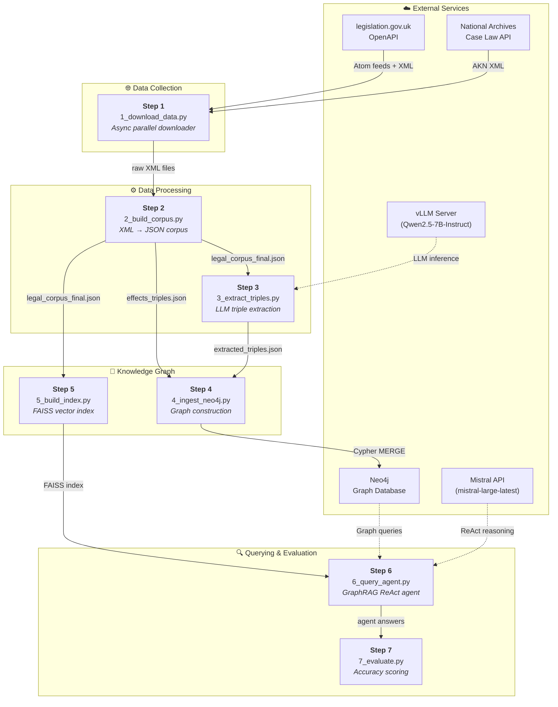
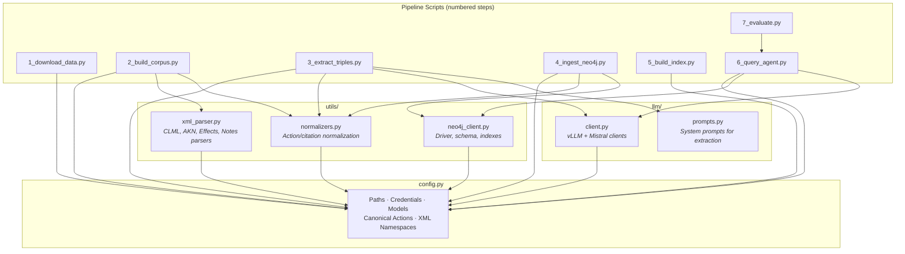
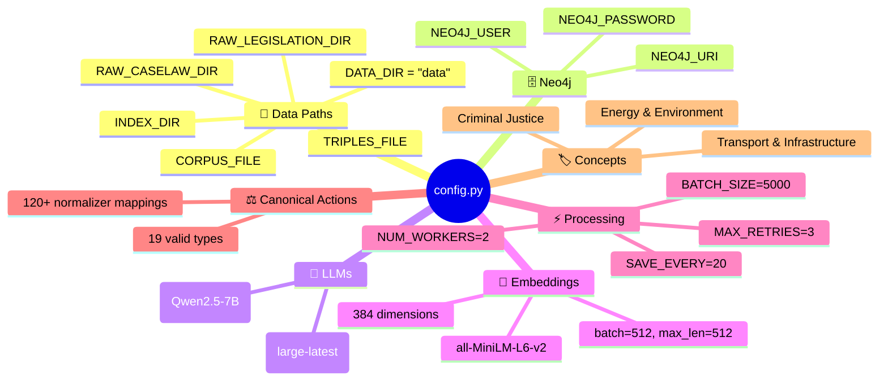

# LegalKGent — Pipeline Overview & Architecture

> A 7-step GraphRAG pipeline that builds a UK Legal Knowledge Graph from raw legislation XML and provides a hybrid query agent.

---

## High-Level Architecture



---

## Module Dependency Map



---

## File Map

| File | Location | Lines | Purpose |
|------|----------|-------|---------|
| `config.py` | Root | 206 | Centralised configuration — paths, credentials, models, canonical actions |
| `1_download_data.py` | Root | 796 | Async parallel downloader for UK legislation & case law XML |
| `2_build_corpus.py` | Root | 78 | Orchestrates XML parsing into unified JSON corpus |
| `3_extract_triples.py` | Root | 362 | LLM-based knowledge triple extraction with checkpointing |
| `4_ingest_neo4j.py` | Root | 314 | Ingests triples into Neo4j with confidence accumulation |
| `5_build_index.py` | Root | 104 | Builds FAISS vector index from corpus embeddings |
| `6_query_agent.py` | Root | 477 | Hybrid GraphRAG ReAct agent (FAISS + Neo4j + Mistral) |
| `7_evaluate.py` | Root | 148 | Runs test questions and scores agent accuracy |
| `utils/xml_parser.py` | utils/ | 628 | All XML parsers — legislation, case law, effects, notes |
| `utils/normalizers.py` | utils/ | 124 | Action & citation normalization, abbreviation expansion |
| `utils/neo4j_client.py` | utils/ | 74 | Neo4j connection management and schema queries |
| `llm/client.py` | llm/ | 71 | LLM client wrappers (vLLM + Mistral) and JSON parsing |
| `llm/prompts.py` | llm/ | 85 | System prompts for triple extraction |

---

## Configuration — `config.py`

### Key Configuration Sections



### The 19 Canonical Actions

| Category | Actions |
|----------|---------|
| **Legislative Modification** | `AMENDS`, `REPEALS`, `SUBSTITUTES`, `INSERTS`, `COMMENCES`, `REVOKES`, `APPLIES`, `CITES`, `OVERRULES` |
| **Semantic** | `DEFINES`, `INTERPRETS`, `DELEGATES`, `IMPLEMENTS` |
| **Power & Obligation** | `CREATES`, `EMPOWERS`, `REQUIRES`, `PROHIBITS`, `EXTENDS` |

The `ACTION_NORMALIZER` dictionary maps **120+ LLM output variations** to these 19 canonical forms:

```
"AMEND" → "AMENDS"       "OMIT" → "REPEALS"        "REPLACE" → "SUBSTITUTES"
"AUTHORISE" → "EMPOWERS"  "FOLLOWS" → "CITES"       "SET_ASIDE" → "OVERRULES"
"MANDATE" → "REQUIRES"    "RESTRICT" → "PROHIBITS"   "RENEW" → "EXTENDS"
```

### `is_caselaw(id_str: str) → bool`

Checks if a chunk ID belongs to case law by presence of prefixes: `uksc_`, `ewca_`, `ewhc_`, `ukut_`.
