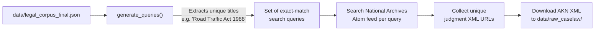
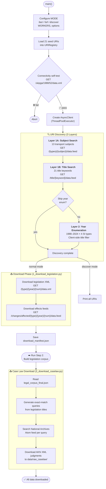
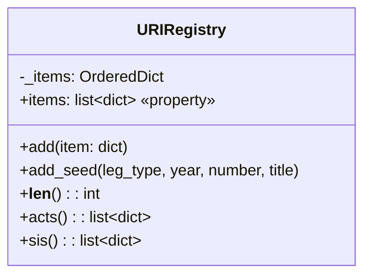
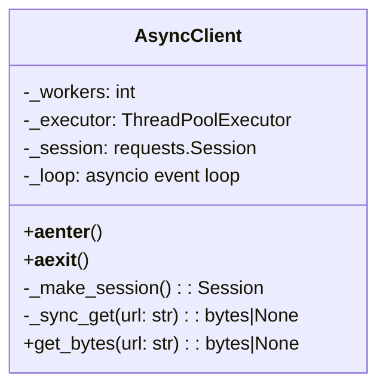
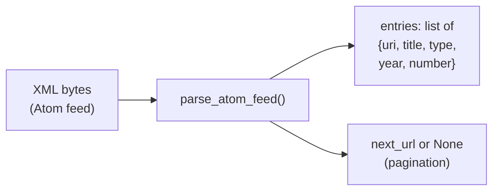
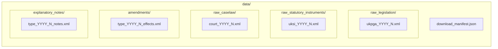

# Step 1 — Data Download (`1_download_legislation.py` + `3_download_caselaw.py`)

> **`1_download_legislation.py`** — Async parallel downloader using `requests` + `ThreadPoolExecutor`. Downloads UK legislation, statutory instruments, effects feeds, and explanatory notes.  
> **`3_download_caselaw.py`** — Downloads case law judgments from the National Archives API.  
> Case law download is a **separate, later step** because it depends on the legislation corpus built by Step 2: it reads `data/legal_corpus_final.json` to extract legislation titles, which are then used as exact-match search queries against the National Archives Atom feed.

---

## Pipeline Execution Order

The data download is split across **two scripts** that must run in a specific order with an intermediate processing step in between:

```
Step 1A  →  Step 2  →  Step 1B
```

| Order | Script | What it does | Depends on |
|-------|--------|-------------|------------|
| **1st** | `1_download_legislation.py` | Downloads legislation XML, statutory instruments, effects feeds | Nothing — runs first |
| **2nd** | `2_build_corpus_legislation.py` | Parses raw XML into `legal_corpus_final.json` | Raw XML from Step 1A |
| **3rd** | `3_download_caselaw.py` | Downloads case law judgments from National Archives | `legal_corpus_final.json` from Step 2 |

> [!IMPORTANT]
> **You cannot run `3_download_caselaw.py` before Step 2.** It reads `data/legal_corpus_final.json` to extract every unique legislation title (e.g. `"Road Traffic Act 1988"`) and uses those titles as search queries. If the corpus file doesn't exist, the script aborts with an error.

---

## What Gets Downloaded First — Legislation (`1_download_legislation.py`)

This script handles the bulk of the data acquisition in three phases:

### Phase 1: URI Discovery (find *what* to download)

The script discovers legislation URIs through **three layers**, each progressively wider:

1. **Layer 1A — Subject path search:** Queries 13 transport-related subjects (e.g. `transport`, `road-traffic`, `highways`) across all legislation types via `GET /{type}/{subject}/data.feed`
2. **Layer 1B — Title keyword search:** Searches 21 title keywords (e.g. `"automated vehicles"`, `"road traffic"`) via `GET /title/{keyword}/data.feed`
3. **Layer 2 — Year enumeration:** Iterates 1988–2024 × 4 SI types (`uksi`, `wsi`, `ssi`, `nisr`), applying a client-side regex filter on titles to keep only transport-related instruments
4. **Seed fallback:** 21 key Acts/SIs are always included regardless of discovery results

### Phase 2: Download (fetch the data)

For every discovered URI, the script downloads in order:

1. **Legislation XML** — Full text of the Act/SI → `data/raw_legislation/` or `data/raw_statutory_instruments/`
2. **Effects feeds** — Amendment/change records → `data/amendments/`
3. **(Optionally) Case law** — A basic court/year/number enumeration (disabled by default; the smart downloader in Step 1B is preferred)

### Phase 3: Manifest

Saves `download_manifest.json` recording all URIs, statistics, and timing.

---

## How Case Law Is Downloaded — Smart Query Approach (`3_download_caselaw.py`)

Unlike legislation (which is discovered by subject/title/year), case law is downloaded using a **query-driven approach** that leverages the already-built legislation corpus:



### Step-by-step process

1. **Read the corpus** — Loads `data/legal_corpus_final.json` and iterates every chunk where `source == "legislation"`
2. **Generate queries** — Extracts the `doc_title` field from each legislation chunk (e.g. `"Automated Vehicles Act 2024"`) and wraps it in quotes for exact-match search. Duplicates are removed automatically via a `set`
3. **Search the Atom feed** — For each query, sends `GET https://caselaw.nationalarchives.gov.uk/atom.xml?query="{title}"` and parses the response for `<link type="application/akn+xml">` entries — these are direct URLs to judgment XML documents
4. **Collect unique links** — Aggregates all judgment URLs across queries into a deduplicated set
5. **Download judgments** — Fetches each AKN XML document and saves it to `data/raw_caselaw/` with a filename derived from the court/year/number (e.g. `uksc_2024_1.xml`)

### Rate limiting & batching

- Searches are batched in groups of 4 (`MAX_CONCURRENT`) with a 1-second pause between batches
- Downloads also run in batches of 4 concurrent requests
- Retry policy: 3 retries with exponential backoff on 429/5xx errors

---

## Complete Execution Flow



---

## Key Classes

### `URIRegistry` — Deduplicated URI Store



**Each registry item:**
```json
{
  "uri":    "/ukpga/2024/3",
  "title":  "Automated Vehicles Act 2024",
  "type":   "ukpga",
  "year":   2024,
  "number": 3
}
```

| Method | Description |
|--------|-------------|
| `add(item)` | Deduplicates by URI key |
| `add_seed(...)` | Adds a seed entry |
| `acts()` | Filters to primary types: `ukpga`, `asp`, `anaw`, `mwa`, `nia`, `ukcm` |
| `sis()` | Filters to secondary types: `uksi`, `ssi`, `wsi`, `nisr`, `ukmo`, `ukmd` |

---

### `AsyncClient` — Thread-Pooled HTTP Client



| Feature | Detail |
|---------|--------|
| **Parallelism** | `ThreadPoolExecutor` with configurable workers (default 2) |
| **Retry Policy** | 3 retries with exponential backoff on 429/436/500-504 |
| **Throttle** | 0.4s delay per request to respect rate limits |
| **Connection pool** | `MAX_CONCURRENT + 4` connections |

---

## Discovery Functions

### Layer 1A — Subject Path Search

```
GET /{type}/{subject}/data.feed
```

**13 Transport Subjects:** `transport`, `road-traffic`, `road-safety`, `highways`, `motor-vehicles`, `driving-licences`, `railways`, `aviation`, `shipping`, `public-transport`, `vehicle-excise`, `traffic-regulation`, `tachographs`

### Layer 1B — Title Keyword Search

```
GET /title/{encoded_keyword}/data.feed
```

**21 Title Keywords:** `transport act`, `road traffic`, `road safety`, `highways act`, `motor vehicles`, `driving licences`, `traffic signs`, `traffic regulation`, `railways act`, `civil aviation`, `air traffic`, `unmanned aircraft`, `automated vehicles`, `electric vehicles`, `taxis`, `private hire vehicles`, `goods vehicles`, `vehicle registration`, `tachograph`, `pedicabs`, `shipping act`

### Layer 2 — Year Enumeration

```
GET /{type}/{year}/data.feed  →  client-side filter by title regex
```

**Range:** 1988–2024 × `[uksi, wsi, ssi, nisr]`

---

## Download Functions

| Function | Script | API Endpoint | Target Dir | Notes |
|----------|--------|-------------|------------|-------|
| `download_legislation()` | `1_download_legislation.py` | `/{type}/{year}/{num}/data.xml` | `raw_legislation/` or `raw_statutory_instruments/` | Skips existing files |
| `download_effects()` | `1_download_legislation.py` | `/changes/affected/{type}/{year}/{num}/data.feed` | `amendments/` | Ground-truth effects data |
| `generate_queries()` | `3_download_caselaw.py` | — | — | Reads corpus, builds title queries |
| `extract_caselaw_links()` | `3_download_caselaw.py` | `atom.xml?query={title}` | — | Searches National Archives Atom feed |
| `download_judgments()` | `3_download_caselaw.py` | `/{court}/{year}/{num}/data.xml` | `raw_caselaw/` | AKN XML format |

---

## Atom Feed Parsing



`_exhaust_feed()` follows the Atom `rel=next` links until exhausted (up to `MAX_PAGES=300`).

---

## Output Files



### `download_manifest.json` Structure

```json
{
  "download_time":    "2024-03-17T18:26:05",
  "domain":           "UK Transportation Law",
  "api_version":      "v3 (Official OpenAPI)",
  "elapsed_seconds":  1234.5,
  "discovery_layers": ["subject_path_search", "title_keyword_search", "year_enumeration", "seed_fallback"],
  "stats":            { "legislation": 150, "effects": 120, "notes": 30, "cases": 90 },
  "total_uris":       300,
  "acts_count":       80,
  "sis_count":        220,
  "items": [
    { "uri": "/ukpga/2024/3", "title": "Automated Vehicles Act 2024", "type": "ukpga", "year": 2024, "number": 3 }
  ]
}
```

---

## Seed Acts (21 Always-Included)

Key legislation that is always downloaded regardless of discovery results:

| Type | Year | Title |
|------|------|-------|
| ukpga | 2024 | Automated Vehicles Act 2024 |
| ukpga | 2024 | Pedicabs (London) Act 2024 |
| ukpga | 1988 | Road Traffic Act 1988 |
| ukpga | 1988 | Road Traffic Offenders Act 1988 |
| ukpga | 1984 | Road Traffic Regulation Act 1984 |
| ukpga | 2006 | Road Safety Act 2006 |
| ukpga | 2000 | Transport Act 2000 |
| ukpga | 1993 | Railways Act 1993 |
| ukpga | 2005 | Railways Act 2005 |
| ukpga | 2021 | Air Traffic Management and Unmanned Aircraft Act 2021 |
| ukpga | 2018 | Automated and Electric Vehicles Act 2018 |
| ukpga | 1980 | Highways Act 1980 |
| ukpga | 2023 | Energy Act 2023 |
