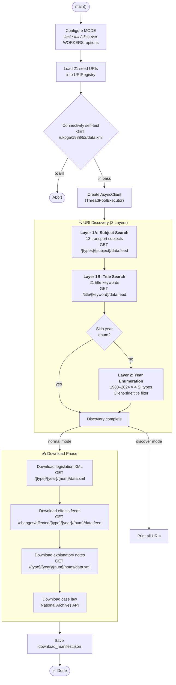
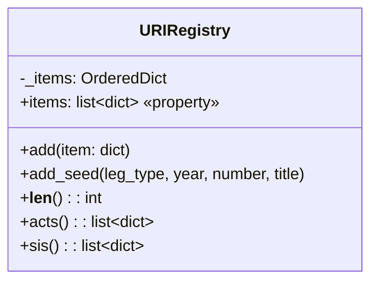
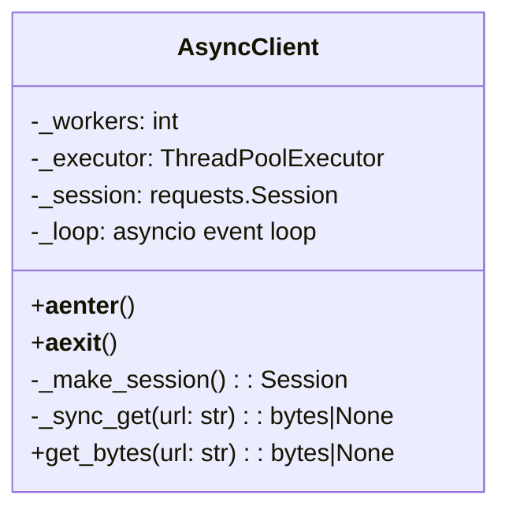
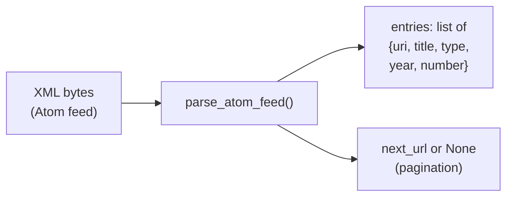
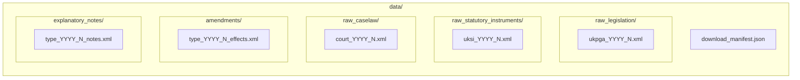

# Step 1 — Data Download (`1_download_data.py`)

> **796 lines** · Async parallel downloader using `requests` + `ThreadPoolExecutor`.  
> Downloads UK legislation, statutory instruments, case law, effects feeds, and explanatory notes from official APIs.

---

## Complete Execution Flow



---

## Key Classes

### `URIRegistry` — Deduplicated URI Store



**Each registry item:**
```json
{
  "uri":    "/ukpga/2024/3",
  "title":  "Automated Vehicles Act 2024",
  "type":   "ukpga",
  "year":   2024,
  "number": 3
}
```

| Method | Description |
|--------|-------------|
| `add(item)` | Deduplicates by URI key |
| `add_seed(...)` | Adds a seed entry |
| `acts()` | Filters to primary types: `ukpga`, `asp`, `anaw`, `mwa`, `nia`, `ukcm` |
| `sis()` | Filters to secondary types: `uksi`, `ssi`, `wsi`, `nisr`, `ukmo`, `ukmd` |

---

### `AsyncClient` — Thread-Pooled HTTP Client



| Feature | Detail |
|---------|--------|
| **Parallelism** | `ThreadPoolExecutor` with configurable workers (default 2) |
| **Retry Policy** | 3 retries with exponential backoff on 429/436/500-504 |
| **Throttle** | 0.4s delay per request to respect rate limits |
| **Connection pool** | `MAX_CONCURRENT + 4` connections |

---

## Discovery Functions

### Layer 1A — Subject Path Search

```
GET /{type}/{subject}/data.feed
```

**13 Transport Subjects:** `transport`, `road-traffic`, `road-safety`, `highways`, `motor-vehicles`, `driving-licences`, `railways`, `aviation`, `shipping`, `public-transport`, `vehicle-excise`, `traffic-regulation`, `tachographs`

### Layer 1B — Title Keyword Search

```
GET /title/{encoded_keyword}/data.feed
```

**21 Title Keywords:** `transport act`, `road traffic`, `road safety`, `highways act`, `motor vehicles`, `driving licences`, `traffic signs`, `traffic regulation`, `railways act`, `civil aviation`, `air traffic`, `unmanned aircraft`, `automated vehicles`, `electric vehicles`, `taxis`, `private hire vehicles`, `goods vehicles`, `vehicle registration`, `tachograph`, `pedicabs`, `shipping act`

### Layer 2 — Year Enumeration

```
GET /{type}/{year}/data.feed  →  client-side filter by title regex
```

**Range:** 1988–2024 × `[uksi, wsi, ssi, nisr]`

---

## Download Functions

| Function | API Endpoint | Target Dir | Notes |
|----------|-------------|------------|-------|
| `download_legislation()` | `/{type}/{year}/{num}/data.xml` | `raw_legislation/` or `raw_statutory_instruments/` | Skips existing files |
| `download_effects()` | `/changes/affected/{type}/{year}/{num}/data.feed` | `amendments/` | Ground-truth effects data |
| `download_notes()` | `/{type}/{year}/{num}/{notesType}/data.xml` | `explanatory_notes/` | Acts only (`notes` type) |
| `download_case_law()` | National Archives: `/{court}/{year}/{num}/data.xml` | `raw_caselaw/` | 3 courts × 3 years |

---

## Atom Feed Parsing



`_exhaust_feed()` follows the Atom `rel=next` links until exhausted (up to `MAX_PAGES=300`).

---

## Output Files



### `download_manifest.json` Structure

```json
{
  "download_time":    "2024-03-17T18:26:05",
  "domain":           "UK Transportation Law",
  "api_version":      "v3 (Official OpenAPI)",
  "elapsed_seconds":  1234.5,
  "discovery_layers": ["subject_path_search", "title_keyword_search", "year_enumeration", "seed_fallback"],
  "stats":            { "legislation": 150, "effects": 120, "notes": 30, "cases": 90 },
  "total_uris":       300,
  "acts_count":       80,
  "sis_count":        220,
  "items": [
    { "uri": "/ukpga/2024/3", "title": "Automated Vehicles Act 2024", "type": "ukpga", "year": 2024, "number": 3 }
  ]
}
```

---

## Seed Acts (21 Always-Included)

Key legislation that is always downloaded regardless of discovery results:

| Type | Year | Title |
|------|------|-------|
| ukpga | 2024 | Automated Vehicles Act 2024 |
| ukpga | 2024 | Pedicabs (London) Act 2024 |
| ukpga | 1988 | Road Traffic Act 1988 |
| ukpga | 1988 | Road Traffic Offenders Act 1988 |
| ukpga | 1984 | Road Traffic Regulation Act 1984 |
| ukpga | 2006 | Road Safety Act 2006 |
| ukpga | 2000 | Transport Act 2000 |
| ukpga | 1993 | Railways Act 1993 |
| ukpga | 2005 | Railways Act 2005 |
| ukpga | 2021 | Air Traffic Management and Unmanned Aircraft Act 2021 |
| ukpga | 2018 | Automated and Electric Vehicles Act 2018 |
| ukpga | 1980 | Highways Act 1980 |
| ukpga | 2023 | Energy Act 2023 |
