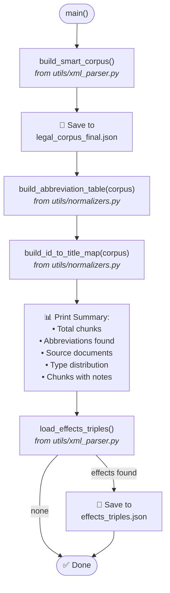
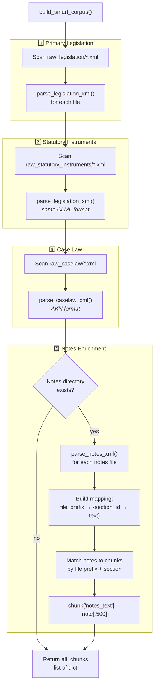
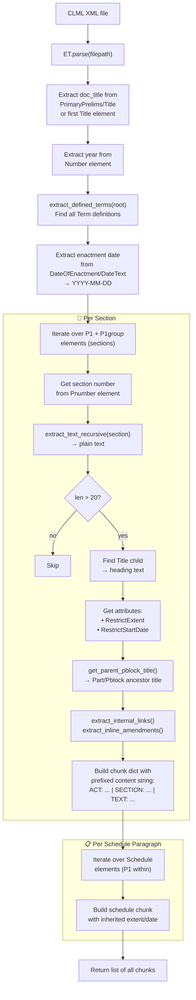
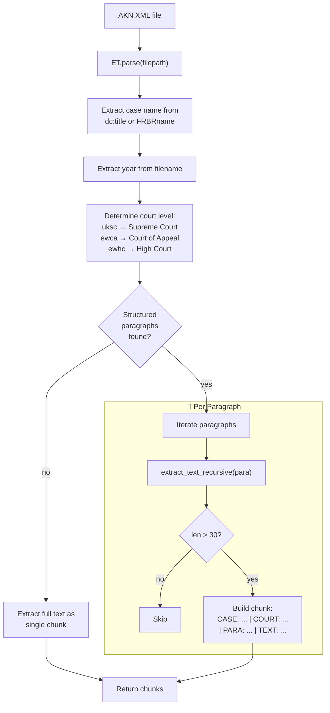
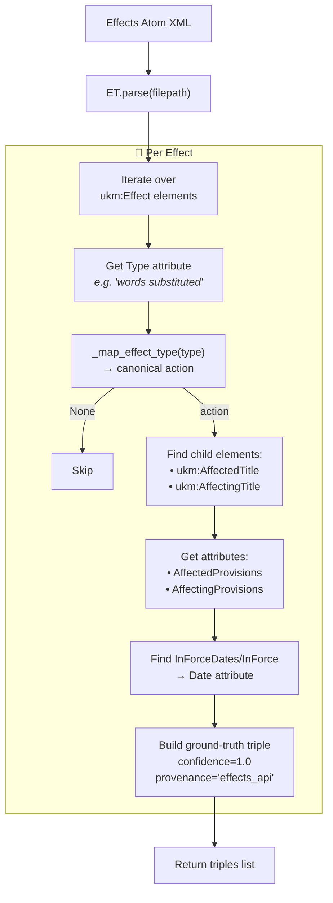
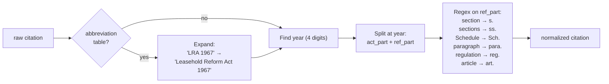

# Step 2 — Corpus Building & XML Parsing

> **`2_build_corpus.py`** (78 lines) orchestrates parsing.  
> **`utils/xml_parser.py`** (628 lines) contains all XML parsers.  
> **`utils/normalizers.py`** (124 lines) provides abbreviation & citation normalization.

---

## Orchestrator Flow (`2_build_corpus.py`)



---

## Smart Corpus Builder (`build_smart_corpus`)



---

## XML Parsers — Detailed Flows

### `parse_legislation_xml()` — CLML Parser

Handles both primary legislation (Acts) and statutory instruments.



### `parse_caselaw_xml()` — AKN Parser



### `parse_effects_xml()` — Effects Feed Parser



### `parse_notes_xml()` — Explanatory Notes Parser

Returns `dict[section_ref → commentary_text]` by scanning:
1. `<Comment>` elements
2. `<Commentary>` elements
3. `<P>` paragraph elements with parent section references

---

## Helper Functions (`utils/xml_parser.py`)

| Function | Input | Output | Purpose |
|----------|-------|--------|---------|
| `_leg(tag)` | Tag name | `{LEG_NS}tag` | Namespace prefix for legislation |
| `_akn(tag)` | Tag name | `{AKN_NS}tag` | Namespace prefix for AKN |
| `_meta(tag)` | Tag name | `{META_NS}tag` | Namespace prefix for metadata |
| `extract_text_recursive(elem)` | XML element | Plain text | Recursively extracts all text, strips tags |
| `extract_defined_terms(root)` | XML root | `{short: full}` | Finds `<Term>` definitions |
| `extract_internal_links(section)` | Section elem | `[ref_text, ...]` | All `<InternalLink>` refs |
| `extract_inline_amendments(section)` | Section elem | `[amend_text, ...]` | All `<InlineAmendment>` text |
| `get_parent_pblock_title(elem, root)` | Elem + root | Title string | Walks up tree for nearest `<Pblock>/<Part>` title |

---

## Normalization Functions (`utils/normalizers.py`)

### `normalize_citation(raw_citation, abbrev_table?) → str`



### Other Functions

| Function | Purpose |
|----------|---------|
| `normalize_action(raw) → str \| None` | Maps LLM output to canonical action via `ACTION_NORMALIZER` + fuzzy substring fallback |
| `extract_act_name(citation) → str` | Strips section ref: `Housing Act 1996 s.122` → `Housing Act 1996` |
| `build_abbreviation_table(corpus) → dict` | Extracts abbreviations from `defined_terms` + text patterns like `'... Full Name Year ("abbrev")'` |
| `build_id_to_title_map(corpus) → dict` | Maps chunk ID prefixes → document titles |

---

## Output Data Structures

### Corpus Chunk (Legislation)

```json
{
  "id":                "ukpga_2024_3.xml_1",
  "source":            "legislation",
  "doc_title":         "Automated Vehicles Act 2024",
  "year":              "2024",
  "section":           "1",
  "part":              "Part 1 — Automated vehicles",
  "heading":           "Meaning of 'self-driving'",
  "extent":            "E+W+S+NI",
  "in_force_date":     "2024-05-20",
  "internal_refs":     ["section 3", "section 5"],
  "inline_amendments": ["for 'word X' substitute 'word Y'"],
  "defined_terms":     {"the 2018 Act": "Automated and Electric Vehicles Act 2018"},
  "notes_text":        "This section defines self-driving...",
  "content":           "ACT: Automated Vehicles Act 2024 (2024) | SECTION: 1 | PART: Part 1 | HEADING: Meaning of 'self-driving' | TEXT: ..."
}
```

### Corpus Chunk (Case Law)

```json
{
  "id":           "ewhc_admin_2023_5.xml_42",
  "source":       "judgment",
  "doc_title":    "R v Secretary of State for Transport",
  "year":         "2023",
  "section":      "42",
  "court_level":  "High Court",
  "content":      "CASE: R v Secretary of State ... | COURT: High Court | PARA: 42 | TEXT: ..."
}
```

### Effects Triple (Ground-Truth)

```json
{
  "source_id":        "effects_Railways Act 2005",
  "source_title":     "Railways Act 2005",
  "source_section":   "s. 12(1)",
  "action":           "SUBSTITUTES",
  "target_citation":  "Transport Act 2000 s. 5(1)",
  "target_act_name":  "Transport Act 2000",
  "detail_text":      "words substituted by Railways Act 2005 s. 12(1)",
  "effective_date":   "2024-01-01",
  "confidence":       1.0,
  "provenance":       "effects_api"
}
```

### Effect Type → Canonical Action Mapping

| API Effect Type | Canonical Action |
|----------------|-----------------|
| `inserted` | `INSERTS` |
| `substituted`, `words substituted`, `s. substituted` | `SUBSTITUTES` |
| `repealed`, `words repealed` | `REPEALS` |
| `amended`, `text amended` | `AMENDS` |
| `applied`, `applied (with modifications)` | `APPLIES` |
| `commenced`, `coming into force` | `COMMENCES` |
| `revoked` | `REVOKES` |
| `extended` | `EXTENDS` |
| `power to modify` | `EMPOWERS` |
| `restricted` | `PROHIBITS` |
