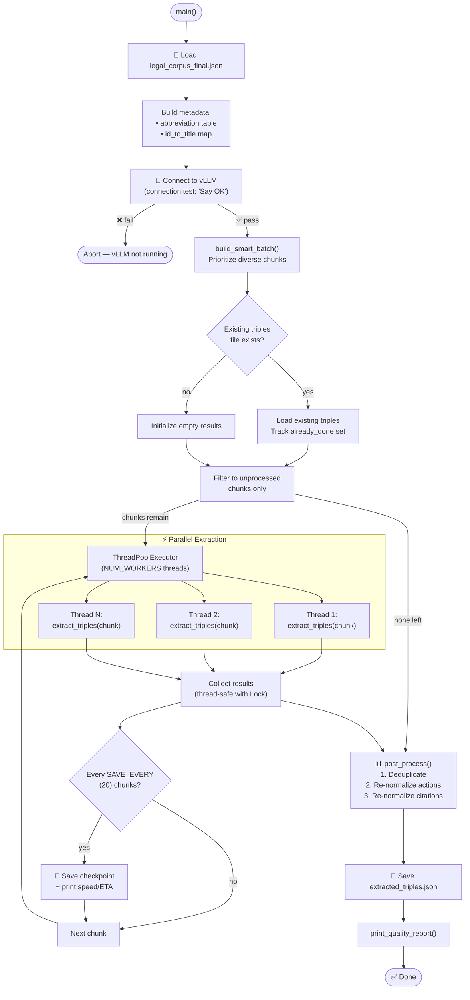
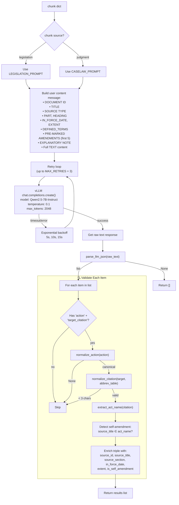
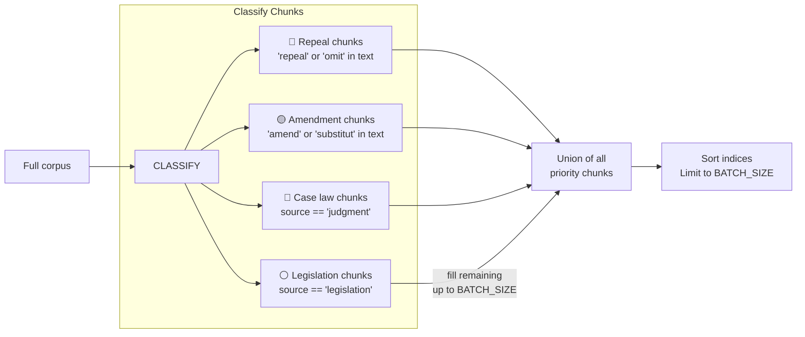
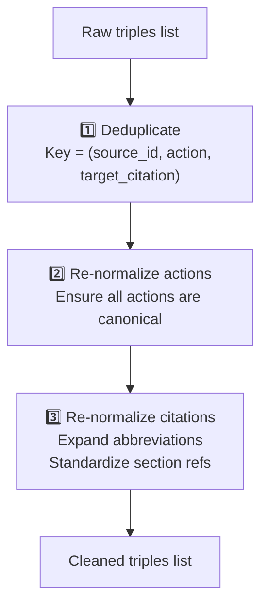
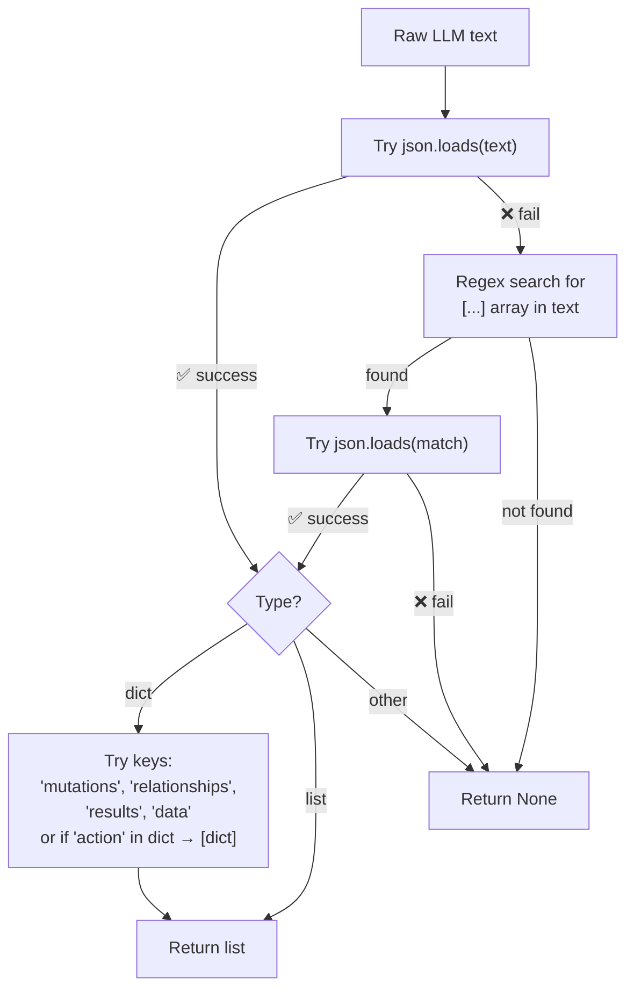

# Step 3 — Triple Extraction (`3_extract_triples.py`)

> **362 lines** · LLM-based knowledge triple extraction using vLLM with parallel workers, resumable checkpointing, and post-processing.

---

## Complete Execution Flow



---

## `extract_triples()` — Per-Chunk LLM Extraction



---

## `build_smart_batch()` — Intelligent Chunk Selection



---

## `post_process()` — Deduplication & Re-normalization



---

## System Prompts (`llm/prompts.py`)

### `LEGISLATION_PROMPT`

Instructs the LLM to extract relationships from legislation text. Defines 19 relationship types with trigger patterns:

| Action | Pattern Examples |
|--------|-----------------|
| `AMENDS` | "is amended", "for X substitute Y" |
| `REPEALS` | "is repealed", "shall cease to have effect", "is omitted" |
| `SUBSTITUTES` | "for 'X' substitute 'Y'" |
| `INSERTS` | "after section X insert" |
| `COMMENCES` | "comes into force on" |
| `DEFINES` | "'automated vehicle' means..." |
| `EMPOWERS` | "The Secretary of State may by regulations..." |
| `REQUIRES` | "the operator must...", "shall notify" |
| `PROHIBITS` | "no person shall...", "it is an offence to..." |

### `CASELAW_PROMPT`

Emphasizes judicial actions most common in case law:
- **CITES** — court refers to, considers, follows, or applies
- **OVERRULES** — court overrules, reverses, departs from
- **INTERPRETS** — court interprets or construes
- **APPLIES** — court applies a statute to the facts

### Required LLM Output Format

```json
[
  {
    "action":           "AMENDS",
    "target_citation":  "Road Traffic Act 1988 s.5",
    "detail_text":      "for 'prescribed limit' substitute 'specified limit'",
    "effective_date":   "2024-01-01"
  }
]
```

---

## LLM JSON Parser (`llm/client.py`)

### `parse_llm_json(raw_text) → list[dict] | None`



---

## Output Data Structure — `extracted_triples.json`

```json
{
  "action":              "AMENDS",
  "target_citation":     "Road Traffic Act 1988 s.5",
  "target_act_name":     "Road Traffic Act 1988",
  "detail_text":         "for 'prescribed limit' substitute 'specified limit'",
  "effective_date":      "2024-01-01",
  "source_id":           "ukpga_2024_3.xml_1",
  "source_title":        "Automated Vehicles Act 2024",
  "source_section":      "1",
  "in_force_date":       "2024-05-20",
  "extent":              "E+W+S+NI",
  "is_self_amendment":   false,
  "chunk_id":            "ukpga_2024_3.xml_1"
}
```

---

## Quality Report — `print_quality_report()`

Prints after extraction:
- **Action distribution** — count per canonical action (✅ / ❌ marker for valid/invalid)
- **Self-amendments** — count of triples where source modifies itself
- **With effective_date** — count of triples with dates
- **With detail_text** — count of triples with detail
