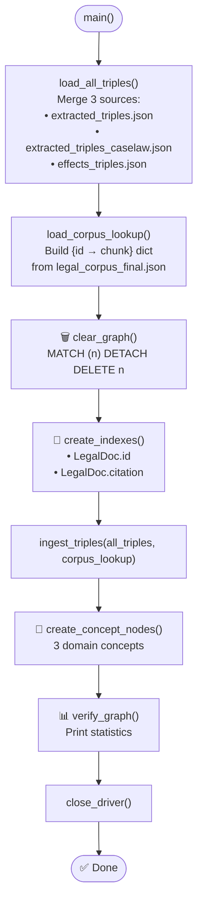
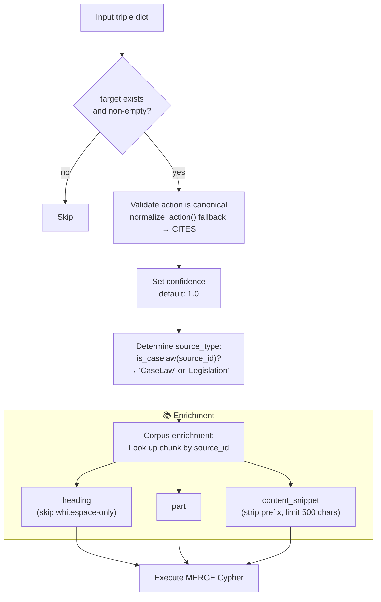
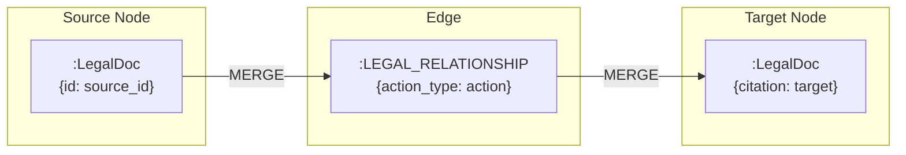
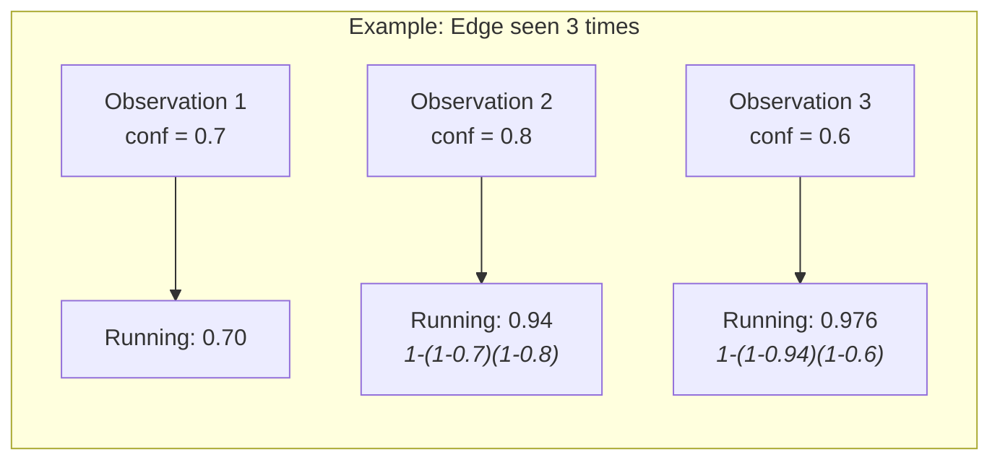
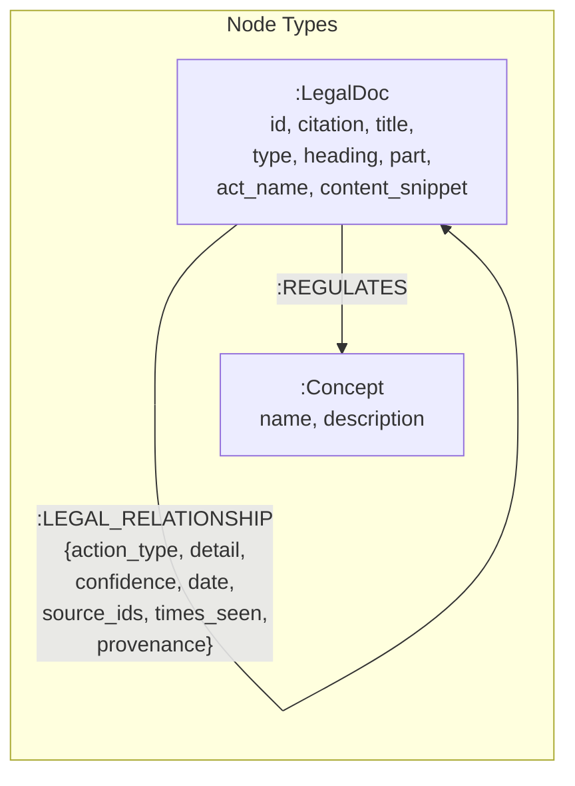
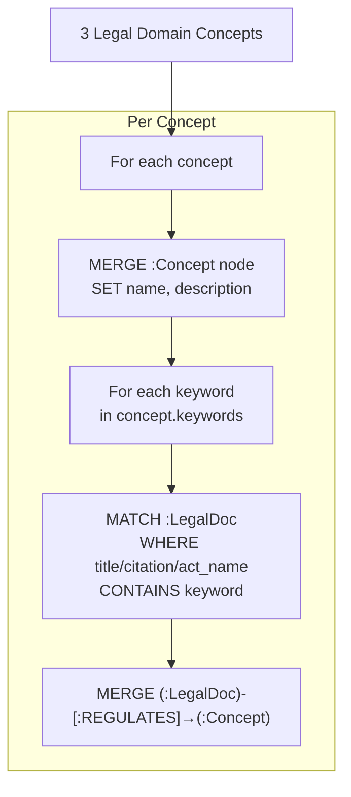
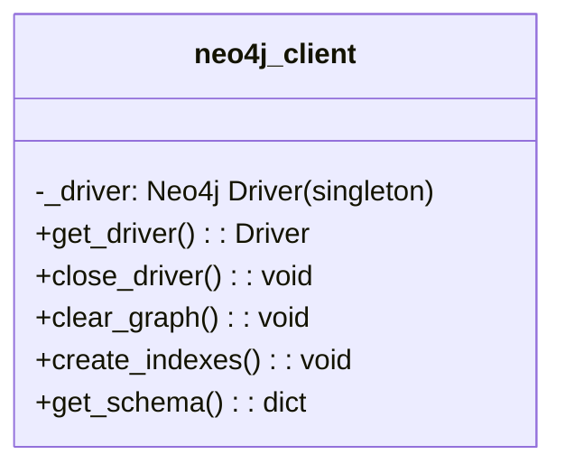

# Step 4 — Neo4j Ingestion (`4_ingest_neo4j.py`)

> **314 lines** · Ingests extracted triples into Neo4j with confidence accumulation, corpus enrichment, concept nodes, and provenance tracking.

---

## Complete Execution Flow



---

## Per-Triple Ingestion Flow



---

## Cypher MERGE Pattern



### ON CREATE vs ON MATCH Behavior

| Property | ON CREATE (new edge) | ON MATCH (existing edge) |
|----------|---------------------|--------------------------|
| `confidence` | Set to initial value | **Accumulated**: `1 - (1-old) × (1-new)` |
| `source_ids` | `[source_id]` | Append if not already present |
| `times_seen` | `1` | Increment by 1 |
| `detail` | Set from triple | COALESCE (keep existing or set new) |
| `date` | Set from triple | COALESCE (keep existing or set new) |
| `provenance` | Set from triple | Not updated on match |

### Confidence Accumulation Formula (Noisy-OR)

```
new_confidence = 1.0 − (1.0 − existing_confidence) × (1.0 − incoming_confidence)
```



---

## Neo4j Graph Schema



### `:LegalDoc` Node Properties

| Property | Type | Source | Example |
|----------|------|--------|---------|
| `id` | string | Chunk ID | `ukpga_2024_3.xml_1` |
| `type` | string | Computed | `"Legislation"` or `"CaseLaw"` |
| `title` | string | Triple / corpus | `"Automated Vehicles Act 2024"` |
| `citation` | string | Triple target | `"Road Traffic Act 1988 s.5"` |
| `act_name` | string | Extracted | `"Road Traffic Act 1988"` |
| `heading` | string | Corpus chunk | `"Meaning of 'self-driving'"` |
| `part` | string | Corpus chunk | `"Part 1 — Automated vehicles"` |
| `content_snippet` | string | Corpus (500 chars) | Section text |

### `:LEGAL_RELATIONSHIP` Edge Properties

| Property | Type | Description |
|----------|------|-------------|
| `action_type` | string | One of 19 canonical actions |
| `detail` | string | Detail text (e.g., textual substitution) |
| `confidence` | float | Accumulated (1.0 for API ground-truth) |
| `date` | string | Effective date (YYYY-MM-DD) |
| `source_ids` | list[string] | All chunk IDs that contributed |
| `times_seen` | int | Observation count |
| `provenance` | string | `"llm_extracted"` or `"effects_api"` |

### `:Concept` Nodes

| Property | Type | Description |
|----------|------|-------------|
| `name` | string | Concept name |
| `description` | string | What this concept covers |

---

## Concept Node Creation



| Concept | Keywords (sample) | Description |
|---------|-------------------|-------------|
| **Transport and Infrastructure** | transport, road traffic, highway, motor vehicle, railway, aviation, shipping, automated vehicle, taxi | Legislation covering road, rail, aviation, maritime transport |
| **Criminal Justice** | criminal, police, offence, court, sentencing, prison, prosecution | Legislation covering criminal law, policing, sentencing |
| **Energy and Environment** | energy, electricity, gas, climate, environment, carbon, renewable, nuclear | Legislation covering energy, climate change, environment |

---

## Graph Verification (`verify_graph()`)

Prints comprehensive statistics:

```
📊 Graph Stats:
   Nodes: 1234
   Edges: 5678
   Types: {'Legislation': 1000, 'CaseLaw': 234}
   Actions: {'AMENDS': 500, 'CITES': 300, ...}
   Provenance: {'llm_extracted': 4000, 'effects_api': 1678}

📈 Confidence Accumulation:
   Edges seen >1 time: 456
   Avg confidence: 0.9234
   Max times seen: 12
```

---

## Neo4j Client (`utils/neo4j_client.py`)



### `get_schema()` Return Structure

```json
{
  "node_count":   1234,
  "edge_count":   5678,
  "action_types": { "AMENDS": 500, "CITES": 300 },
  "concepts":     ["Criminal Justice", "Energy and Environment", "Transport and Infrastructure"],
  "sample_edges": [
    { "source_id": "ukpga_2024_3.xml_1", "action": "AMENDS", "detail": "...", "target": "Road Traffic Act 1988 s.5" }
  ]
}
```
