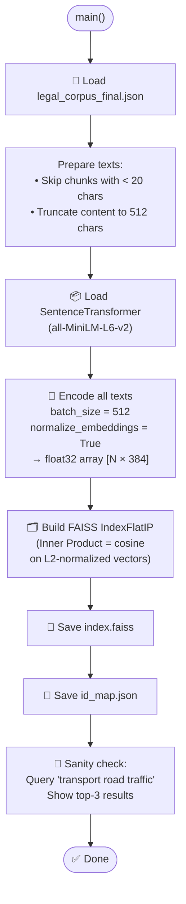
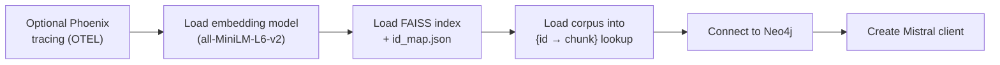
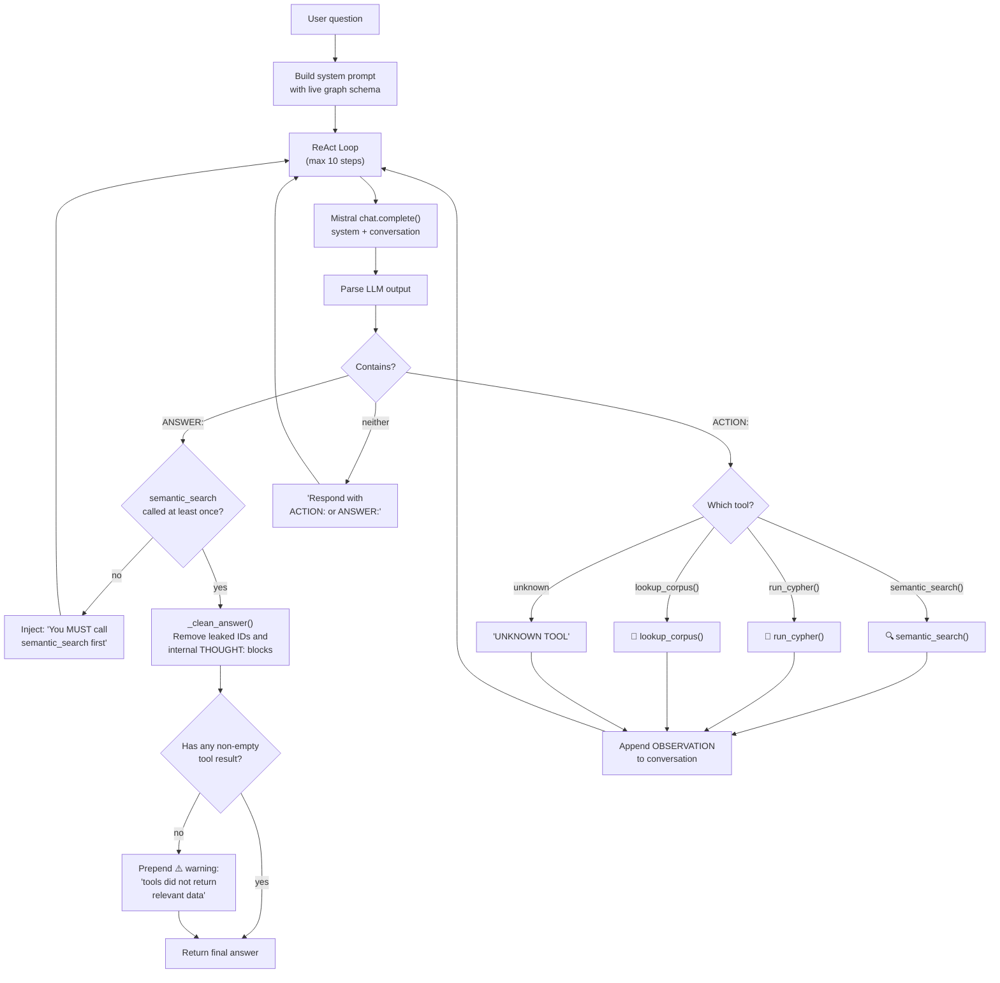
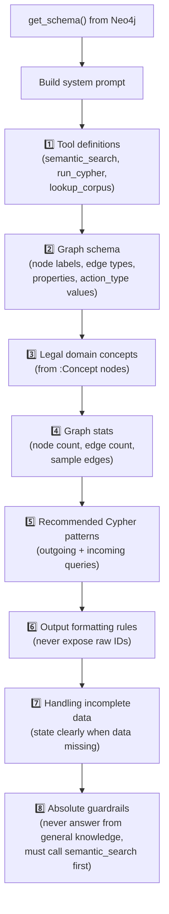

# Steps 5 & 6 — FAISS Index & Query Agent

> **`5_build_index.py`** (104 lines) — Builds a FAISS vector index for semantic search.  
> **`6_query_agent.py`** (477 lines) — Hybrid GraphRAG ReAct agent combining FAISS + Neo4j + Mistral.

---

## Part A: FAISS Index (`5_build_index.py`)

### Execution Flow



### Embedding Configuration

| Parameter | Value | Description |
|-----------|-------|-------------|
| Model | `all-MiniLM-L6-v2` | Sentence-transformers model |
| Dimension | 384 | Vector size |
| Batch Size | 512 | Encoding batch |
| Max Text Length | 512 chars | Input truncation |
| Index Type | `IndexFlatIP` | Exact inner product search |
| Normalization | L2-normalized → IP = cosine similarity | |

### ID Map Entry Format

```json
{
  "node_id":   "ukpga_2024_3.xml_1",
  "doc_title": "Automated Vehicles Act 2024",
  "section":   "1",
  "source":    "legislation",
  "text":      "ACT: Automated Vehicles Act 2024... [first 600 chars]"
}
```

---

## Part B: Query Agent (`6_query_agent.py`)

### Initialization Flow



---

### ReAct Agent Loop (`agent_ask`)



---

### The Three Tools

```mermaid
graph TB
    subgraph "🔍 Tool 1: semantic_search"
        SS_IN["query, top_k=5"] --> SS_ENC["Encode query → 384d vector"]
        SS_ENC --> SS_FAISS["FAISS search → top-k indices + scores"]
        SS_FAISS --> SS_FILTER["Filter by MIN_SIM_THRESHOLD ≥ 0.25"]
        SS_FILTER --> SS_ENRICH["Enrich with heading, part from corpus"]
        SS_ENRICH --> SS_OUT["JSON array of matches"]
    end

    subgraph "🔧 Tool 2: run_cypher"
        RC_IN["Cypher query string"] --> RC_EXEC["Execute against Neo4j"]
        RC_EXEC --> RC_CHECK{"Results?"}
        RC_CHECK -->|"0 rows"| RC_WARN["⚠️ ZERO_RESULTS"]
        RC_CHECK -->|"rows"| RC_OUT["JSON array of records"]
    end

    subgraph "📖 Tool 3: lookup_corpus"
        LC_IN["Comma-separated node IDs"] --> LC_PARSE["Parse IDs (max 10)"]
        LC_PARSE --> LC_LOOKUP["Look up each in corpus dict"]
        LC_LOOKUP --> LC_OUT["JSON: node_id, doc_title,<br/>section, heading, part,<br/>content (800 chars)"]
    end
```



### `semantic_search()` Return Format

```json
[
  {
    "node_id":    "ukpga_2024_3.xml_1",
    "doc_title":  "Automated Vehicles Act 2024",
    "section":    "1",
    "heading":    "Meaning of 'self-driving'",
    "part":       "Part 1 — Automated vehicles",
    "similarity": 0.8234,
    "snippet":    "ACT: Automated Vehicles Act 2024..."
  }
]
```

---

### System Prompt Construction (`build_system_prompt`)



### Anti-Hallucination Guardrails

| Guardrail | Mechanism |
|-----------|-----------|
| **Must use tools** | Agent cannot answer without calling `semantic_search` at least once |
| **No fabrication** | If tool returns ZERO_RESULTS or NO_MATCHES, agent must inform user |
| **No general knowledge** | Only cite data returned by tools |
| **No invented citations** | Never invent section numbers, Act names, or provisions |
| **Clean output** | `_clean_answer()` strips leaked internal IDs from final answer |
| **Grounding check** | If no tool returned real data, answer is prefixed with ⚠️ warning |

---

### Answer Cleaning (`_clean_answer`)

Removes from final answer:
1. `THOUGHT: ...` blocks
2. Internal IDs like `ukpga_2023_55.xml_63` (regex patterns for all court prefixes)
3. Empty parentheses `(  )`
4. Excess whitespace and blank lines
