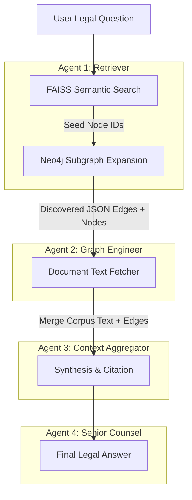

# Step 6: Multi-Agent GraphRAG

> Replacing the legacy monolithic ReAct agent, Step 6 implements a strictly governed, 4-Agent pipeline based on Anthropic's Model Context Protocol (MCP) design pattern. This eliminates hallucination and "infinite loop" Cypher failures.

---

## 1. Pipeline Architecture

The querying process is split sequentially across four specialised agents. Each agent relies on the output of the previous agent, and each is restricted to a precise, sandboxed set of tools.

---

## 2. MCP Tools Catalogue (`utils/mcp_tools.py`)

Rather than giving the LLM free-reign to write Cypher (which frequently causes schema hallucination), the system exposes predefined, typed Python functions (Macros).

### Agent 1 Tools
- `mcp_semantic_search(query)`: Searches the FAISS index. Returns ONLY structural IDs (`node_id`, `score`, `title`), withholding all textual content to prevent LLM distraction.

### Agent 2 Tools
- `mcp_search_nodes_by_title(keyword)`: Directly queries Neo4j `title` strings to bypass semantic index failures for highly specific Act names (e.g., "National Security Act 2023").
- `mcp_get_node_subgraph(node_id, depth)`: Expands a node 1-2 hops outward in all directions, pulling connected actions (`CITES`, `AMENDS`, etc.).
- `mcp_find_relationships(node_id, action_type)`: Targets specifically typed edges (e.g., all `INTERPRETS` edges connected to a case).
- `mcp_find_amendments_timeline(act_title)`: Pulls a chronological list of `AMENDS` edges directed at a specific piece of legislation.
- `mcp_execute_cypher(cypher)`: Raw cypher execution, strictly sandboxed to reject any `WRITE` statements (`CREATE`, `MERGE`, `DELETE`, etc.).

### Agent 3 Tools
- `mcp_read_document_text(node_ids)`: Retrieves the raw `vector_text` chunks directly from `legal_corpus_final.json` without searching the Neo4j API.

---

## 3. Agent Responsibilities & Rulesets

### Agent 1 (The Retriever)
- **Role:** Generates 1-3 varied semantic queries based on the user's question.
- **Rule:** May ONLY return a JSON list of node IDs. Must not attempt to answer the question itself.

### Agent 2 (The Graph Engineer)
- **Role:** Takes the seed node IDs from Agent 1 and executes Neo4j tool macros to discover structural connections.
- **Rule:** Uses `mcp_search_nodes_by_title` if FAISS seeds are irrelevant. Outputs a combined structured JSON: `{"nodes": [...], "edges": [...]}` containing up to 150 edges tracing legal precedents and amendments.

### Agent 3 (The Context Aggregator)
- **Role:** Filters the massive subgraph discovered by Agent 2. Identifies up to 15 highly relevant Node IDs and fetches their full textual data from the corpus.
- **Rule:** Outputs a clean, concatenated string mapping the raw text to its Node ID bracket tag.

### Agent 4 (The Senior Counsel)
- **Role:** Synthesises the text chunks from Agent 3 AND the graph edges from Agent 2 into a professional legal answer.
- **Rule:** Has NO tools. Must cite every proposition using node IDs (e.g., `[ewca_crim_2009_2459.xml_1]`). Must outright refuse to answer if the provided context lacks sufficient structural or textual information, relying purely on the retrieved data to prevent LLM hallucination.
