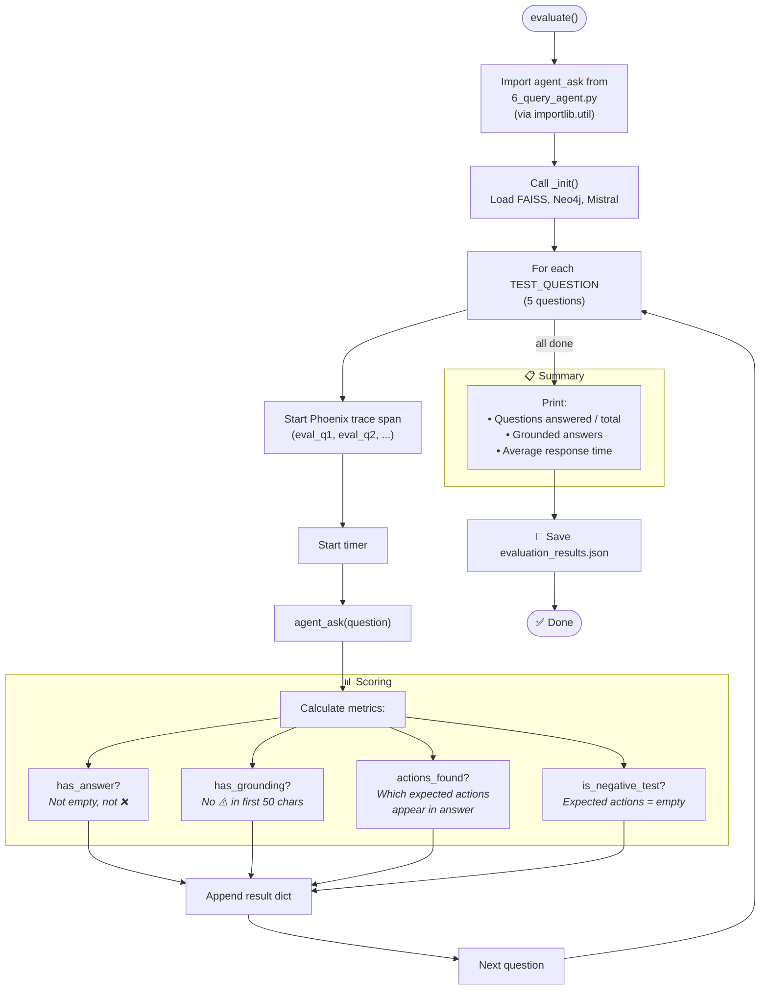
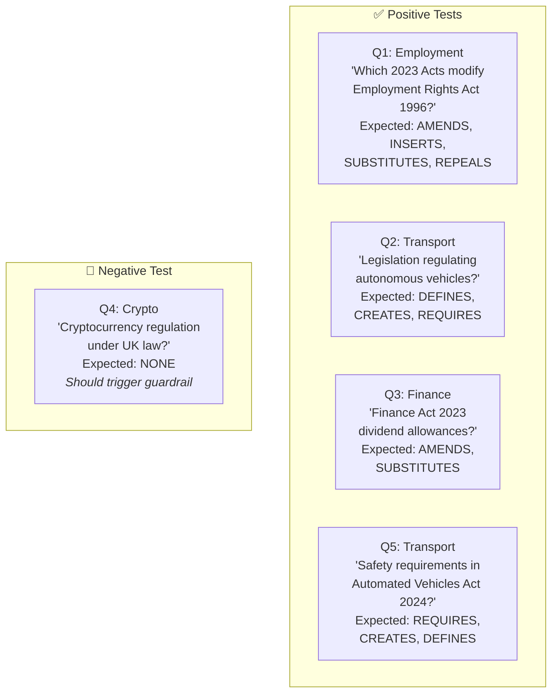
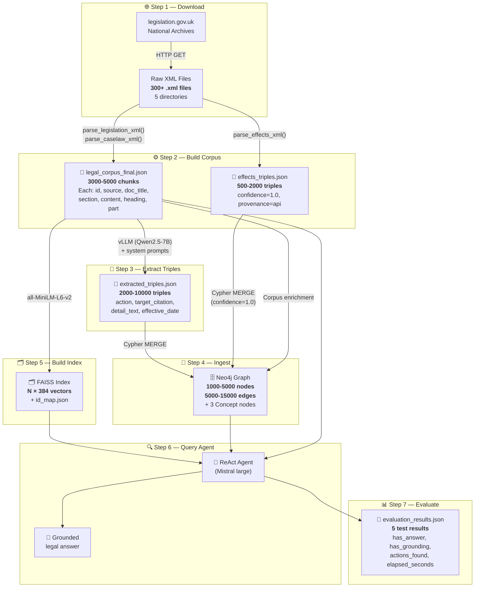
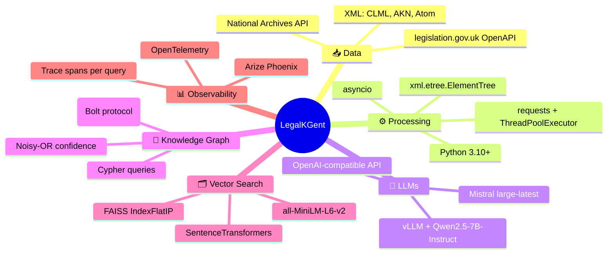

# Step 7 — Evaluation & End-to-End Data Flow

> **`7_evaluate.py`** (148 lines) — Runs 5 test questions against the agent and scores accuracy.  
> This document also contains the **complete end-to-end data flow summary** across all 7 steps.

---

## Part A: Evaluation (`7_evaluate.py`)

### Execution Flow



---

### Test Questions



| # | Domain | Purpose | Expected Behavior |
|---|--------|---------|-------------------|
| Q1 | Employment | Cross-referencing amendments | Find specific amendment actions |
| Q2 | Transport | Broad legislation discovery | Find defining/creating legislation |
| Q3 | Finance | Specific provision changes | Find amendment details |
| Q4 | Crypto | **Negative test** | Should say "not in graph" |
| Q5 | Transport | Specific Act analysis | Find requirements/creations |

---

### Output Format — `results/evaluation_results.json`

```json
[
  {
    "question":          "Which 2023 Acts modify the Employment Rights Act 1996?",
    "domain":            "Employment",
    "answer_length":     1234,
    "elapsed_seconds":   15.3,
    "has_answer":        true,
    "has_grounding":     true,
    "expected_actions":  ["AMENDS", "INSERTS", "SUBSTITUTES", "REPEALS"],
    "actions_found":     ["AMENDS", "SUBSTITUTES"],
    "is_negative_test":  false,
    "error":             null
  },
  {
    "question":          "What are the rules for cryptocurrency regulation under UK law?",
    "domain":            "Crypto (negative test)",
    "answer_length":     320,
    "elapsed_seconds":   8.1,
    "has_answer":        true,
    "has_grounding":     false,
    "expected_actions":  [],
    "actions_found":     [],
    "is_negative_test":  true,
    "error":             null
  }
]
```

---

## Part B: End-to-End Data Flow

### Complete Pipeline Visualisation



---

### Data Transformation Summary Table

| Step | Input | Process | Output | Key Format |
|------|-------|---------|--------|------------|
| **1. Download** | legislation.gov.uk API | Async HTTP GET + Atom feed parsing | `data/raw_*/*.xml` (300+ files) | CLML/AKN XML |
| **2. Corpus** | XML files (5 dirs) | `parse_*_xml()` → chunks + notes enrichment | `legal_corpus_final.json` | `{id, source, doc_title, section, content, heading, part, ...}` |
| **2b. Effects** | `data/amendments/*.xml` | `parse_effects_xml()` | `effects_triples.json` | `{source_title, action, target_citation, confidence: 1.0}` |
| **3. Extract** | Corpus JSON + vLLM | LLM inference → JSON parse → normalize | `extracted_triples.json` | `{action, target_citation, detail_text, source_id, ...}` |
| **4. Ingest** | Triples + Effects + Corpus | MERGE Cypher + confidence accumulation | Neo4j `:LegalDoc` / `:LEGAL_RELATIONSHIP` / `:Concept` | Property graph |
| **5. Index** | Corpus JSON | SentenceTransformer → FAISS IndexFlatIP | `index.faiss` + `id_map.json` | Binary + `{node_id, doc_title, section, text}` |
| **6. Query** | User question | ReAct loop: semantic_search → run_cypher → lookup_corpus | Natural language answer | Grounded legal citation text |
| **7. Evaluate** | 5 test questions | `agent_ask()` per question → score | `evaluation_results.json` | `{has_answer, has_grounding, actions_found, elapsed_seconds}` |

---

### Technology Stack Summary


