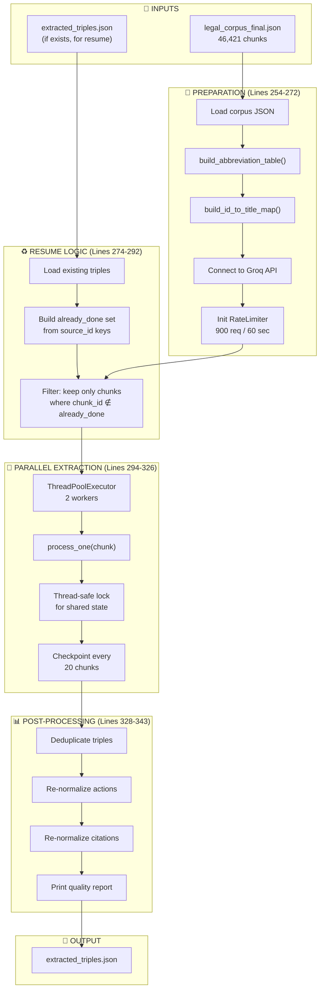
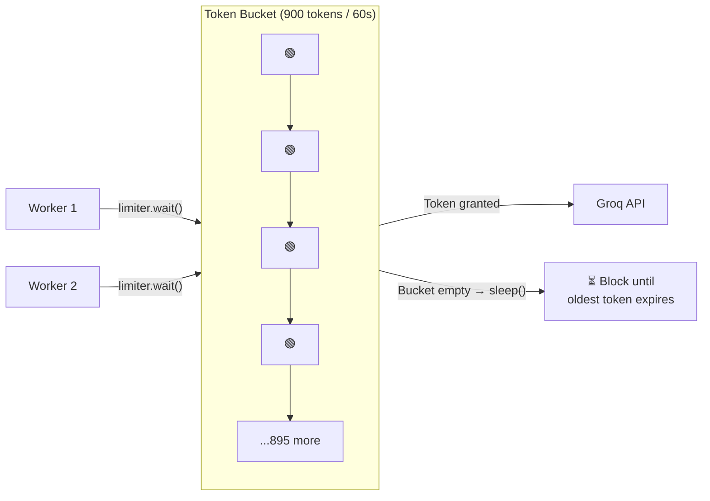
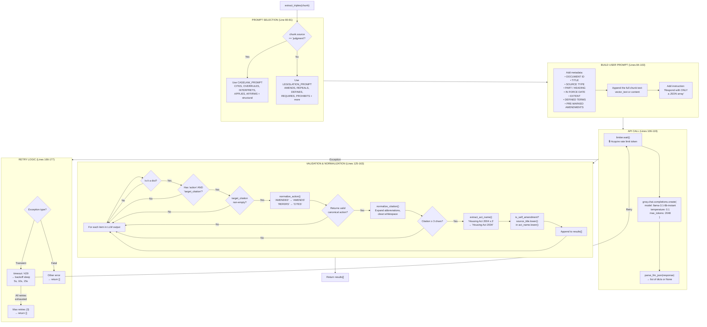
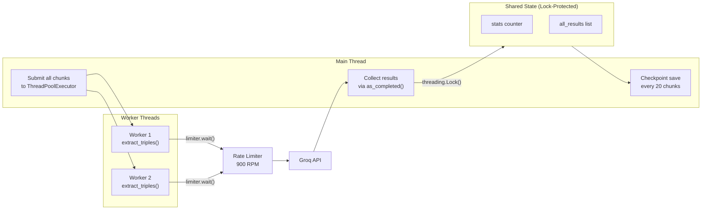
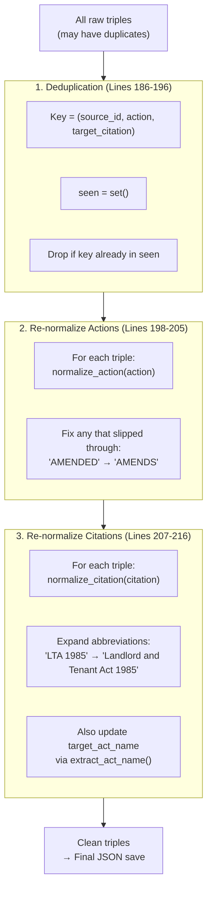

# LegalKGent — `3_extract_triples.py` Data Flow Pipeline

A complete trace of every data manipulation, filter, and transformation in the triple extraction pipeline.

---

## High-Level Architecture



---

## Phase 1: Data Loading & Preparation

### 1.1 Load Corpus (Line 256)

```python
with open(CORPUS_FILE, "r", encoding="utf-8") as f:
    corpus = json.load(f)
```

**What:** Reads all 46,421 chunks from `data/legal_corpus_final.json` into memory.

**Each chunk looks like:**
```json
{
    "chunk_id": "ukpga_1988_53.xml_90A",
    "source": "legislation",
    "doc_title": "Road Traffic Offenders Act 1988",
    "vector_text": "...section text...",
    "section_number": "90A",
    "graph_edges": {...},
    "defined_terms": {...}
}
```
or for case law:
```json
{
    "chunk_id": "ewca_civ_2020_213.xml_2",
    "source": "judgment",
    "doc_title": "Heathrow Hub v SoS Transport [2020] EWCA Civ 213",
    "content": "CASE: ... | COURT: Court of Appeal | PARA: 2 | TEXT: ..."
}
```

> **Key difference:** Legislation chunks store text in `vector_text`, case law stores it in `content`.

---

### 1.2 Build Abbreviation Table (Line 261)

```python
abbrev_table = build_abbreviation_table(corpus)  # → 1,212 entries
```

**What:** Scans all 46k chunks to create a dictionary mapping shorthand references to full Act names.

**Why:** The LLM might output `"the LTA 1985"` instead of `"Landlord and Tenant Act 1985"`. This table lets us fix that later.

**How:** Two sources:
1. `defined_terms` from XML parsing (e.g., `<Term>` elements)
2. Regex matching patterns like: `Full Act Name 1985 ("abbreviation")`

---

### 1.3 Build ID-to-Title Map (Line 262)

```python
id_to_title = build_id_to_title_map(corpus)  # → 410 entries
```

**What:** Maps file-level prefixes to human-readable document titles.

| Prefix | Title |
|---|---|
| `ukpga_1988_53` | Road Traffic Offenders Act 1988 |
| `ewca_civ_2020_213` | Heathrow Hub v SoS Transport [2020] EWCA Civ 213 |

**Why:** Used later for **self-amendment detection** — checking if the LLM extracted a relationship where a document references itself.

---

### 1.4 Groq Client + Rate Limiter (Lines 267-272)

```python
groq_client = get_groq_client()
limiter = RateLimiter(max_calls=900, period=60.0)
```

**What:** Connects to the Groq API and initialises a token bucket rate limiter.

**Why:** Groq has a strict 1,000 RPM limit. The limiter caps us at 900 RPM to prevent 429 errors.



---

## Phase 2: Resume Logic

### 2.1 Load Existing Results (Lines 274-282)

```python
if os.path.exists(TRIPLES_FILE):
    all_results = json.load(f)
    already_done = set(r['source_id'] for r in all_results)
```

**What:** If the script was previously interrupted, it reloads the partial output and builds a set of already-processed `chunk_id`s.

### 2.2 Filter Unprocessed Chunks (Line 285)

```python
chunks_to_process = [c for c in corpus if c['chunk_id'] not in already_done]
```

**What:** Removes chunks that were already extracted in a previous run.

**Why:** This makes the pipeline **fully resumable** — you can Ctrl+C at any time and restart without re-processing.

---

## Phase 3: Per-Chunk Extraction

This is the core pipeline. For each chunk, `extract_triples()` performs this flow:



---

### 3.1 Prompt Selection (Lines 80-81)

```python
is_judgment = chunk.get("source") == "judgment"
system_prompt = CASELAW_PROMPT if is_judgment else LEGISLATION_PROMPT
```

| Source | Prompt | Primary Actions |
|---|---|---|
| `legislation` | `LEGISLATION_PROMPT` | AMENDS, REPEALS, DEFINES, REQUIRES, PROHIBITS, DELEGATES, etc. |
| `judgment` | `CASELAW_PROMPT` | CITES, OVERRULES, INTERPRETS, APPLIES, AFFIRMS + structural |

---

### 3.2 User Prompt Construction (Lines 84-103)

The user prompt is built by concatenating metadata fields. Here's an example of what the LLM actually sees:

```
Extract all legal relationships from this text:

DOCUMENT ID: ukpga_1988_53.xml_90A
TITLE: Road Traffic Offenders Act 1988
SOURCE TYPE: legislation
IN FORCE DATE: 2020-12-31
EXTENT: E+W+S+N.I.
DEFINED TERMS: {"the appropriate person": "..."}
PRE-MARKED AMENDMENTS: [{"affecting_act": "Road Safety Act 2006", ...}]

TEXT:
(1) Where a constable or vehicle examiner has reason to believe that...
[full section text]

Respond with ONLY a JSON array of relationships. If none found, respond with []
```

**Why include all this metadata?** It gives the LLM contextual anchors — the title helps it avoid abbreviating, the extent tells it the jurisdictional scope, and pre-marked amendments guide it toward known relationships.

---

### 3.3 Validation Pipeline (Lines 130-163)

Every raw LLM output item passes through **6 sequential filters**. If any filter fails, the item is silently dropped:

```
LLM returns 5 items → Filter 1 drops 0 → Filter 2 drops 1 → ... → 3 valid triples
```

| # | Filter | What it catches |
|---|---|---|
| 1 | `isinstance(item, dict)` | LLM sometimes returns strings or nulls |
| 2 | `"action" in item and "target_citation" in item` | Malformed JSON objects |
| 3 | `item["target_citation"]` is truthy | Empty citation strings |
| 4 | `normalize_action()` returns non-None | Unknown/hallucinated actions like `"DISCUSSES"` |
| 5 | `len(citation) >= 3` | Garbage like `"s."` or `"it"` |
| 6 | Passes all → appended | Valid triple |

---

### 3.4 Output Triple Schema

Each validated triple looks like:

```json
{
    "action": "REQUIRES",
    "target_citation": "Road Traffic Offenders Act 1988 s.54",
    "target_act_name": "Road Traffic Offenders Act 1988",
    "detail_text": "The person must be given written notification...",
    "effective_date": null,
    "source_id": "ukpga_1988_53.xml_90A",
    "source_title": "Road Traffic Offenders Act 1988",
    "source_section": "90A",
    "in_force_date": "2020-12-31",
    "extent": "E+W+S+N.I.",
    "is_self_amendment": true,
    "chunk_id": "ukpga_1988_53.xml_90A"
}
```

---

## Phase 4: Parallel Orchestration



**Why only 2 workers?** At 5 chunks/sec throughput and 900 RPM limit, 2 workers are enough to saturate the API without triggering rate limits.

---

## Phase 5: Post-Processing



**Why post-process after extraction?** Because the LLM processes chunks independently — two different chunks may reference the same Act with slightly different formatting. Post-processing catches these inconsistencies in a single pass.

---

## Phase 6: Quality Report

The final console output shows:

```
📊 QUALITY REPORT
==================================================

  Action distribution:
    ✅ CITES: 62
    ✅ DEFINES: 14
    ✅ INTERPRETS: 12
    ✅ INSERTS: 11       ← Structural (dual-layer safety net)
    ✅ APPLIES: 6
    ✅ OVERRULES: 1

  Self-amendments: 0/113
  With effective_date: 5/113
  With detail_text: 92/113
```

| Metric | What it tells you |
|---|---|
| Action distribution | Whether the LLM is using the right relationship types |
| `✅` vs `❌` markers | Whether each action is in `CANONICAL_ACTIONS` |
| Self-amendments | How many triples are a document referencing itself |
| With effective_date | How many triples captured temporal information |
| With detail_text | How many triples have explanatory context (higher = better) |
