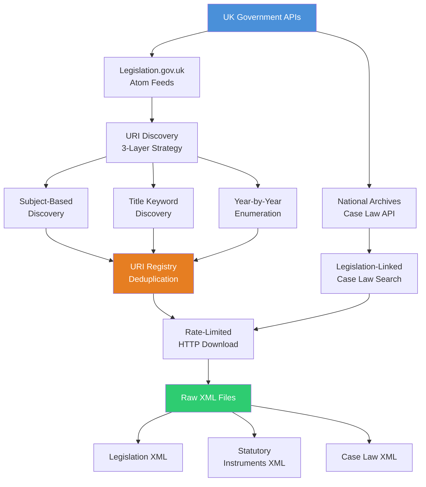
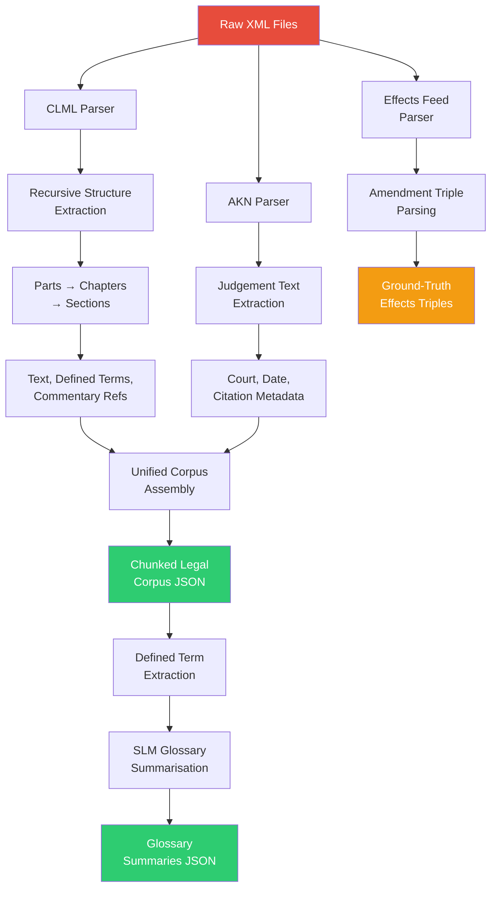
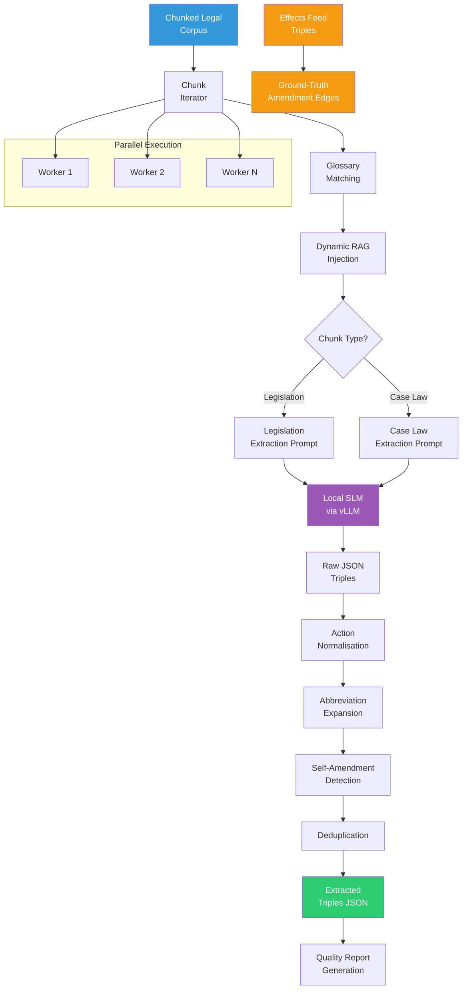
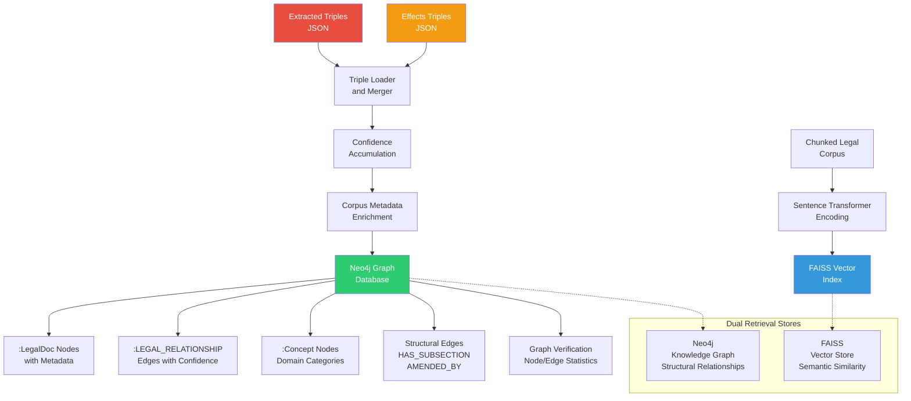
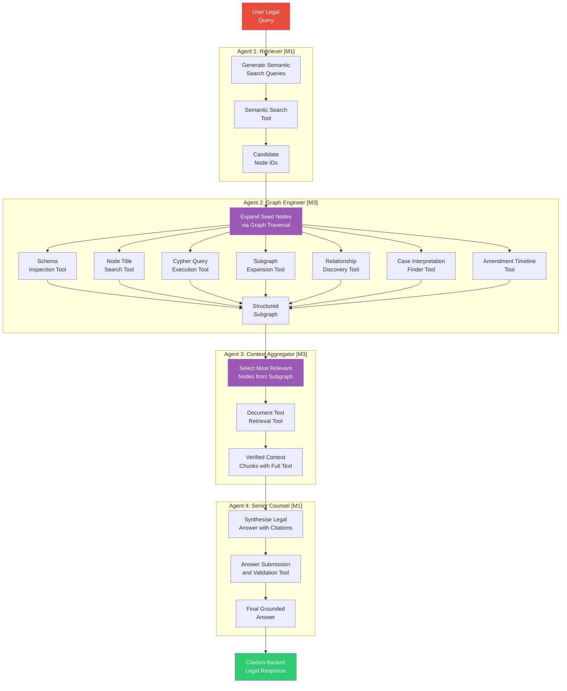

# LegalKGent: Autonomous Knowledge Graph Construction and Multi-Agent Retrieval-Augmented Generation for Interlinked Legal Domains

> **Team Report — Member 3 (M3) Focus**
> Module: MSc Artificial Intelligence & Machine Learning  
> Anglia Ruskin University — April 2026

---

## Abstract

This report presents **LegalKGent**, a system for autonomous construction of legal knowledge graphs using Small Language Models (SLMs) and a multi-agent GraphRAG framework for answering complex legal queries. The complete pipeline spans data collection from UK government legislation and case law APIs, XML parsing into a unified corpus, LLM-based extraction of semantic triples, ingestion into a Neo4j graph database with confidence accumulation, and orchestration of four specialised agents—each equipped with Model Context Protocol (MCP) tools—for graph-aware legal question answering. This document covers the contributions of all three team members, with particular depth on M3's work: knowledge graph creation through triple extraction and Neo4j ingestion, and the design of Agent 2 (Graph Engineer) and Agent 3 (Context Aggregator) within the multi-agent framework. The system is evaluated using a Judge LLM methodology and compared against a standard large language model baseline to demonstrate the effectiveness of graph-augmented retrieval for interlinked legal domains.

**Keywords:** Knowledge Graph, Retrieval-Augmented Generation, Multi-Agent Systems, Legal AI, Neo4j, Small Language Models, MCP Tools, Agentic AI

---

## I. Introduction

The AI landscape is currently driving towards automating processes that involve human intelligence using Agentic AI. The Agentic AI uses external databases to solve user queries by retrieving relevant information, also known as RAG (Retrieval-Augmented Generation). The traditional vector store and the relational databases were connected to LLMs using MCP tools; the vector store retrieves documents using similarity search, but this works for flat documents, and can query SQL on RDBMS to fetch relevant rows, but this works only with relational data. However, some data domains like medical data referred by doctors and law documentation referred by lawyers are interlinked with each other.

For example: a judge can overrule an existing act for a specific scenario; a lower court's ruling may be surpassed by a Supreme Court judgement for a specific case, etc. Or the same act might be amended with modified rules in a timely manner, etc.

To capture all of these interlinked data points, the traditional vector store alone may not help the agents to solve the user query. There is a fundamental need for a **graph-based representation** that can model the rich web of relationships — amendments, interpretations, overrulings, delegations, and definitions — that define how legal instruments interact with each other over time. A flat document retrieval system may return a statutory section that mentions an amendment, but it cannot trace the chain of amendments back through time, identify which court decisions have interpreted that provision, or determine whether a subsequent statutory instrument has modified its scope. These are inherently graph traversal problems.

This project addresses this challenge by constructing a **knowledge graph** from UK transport legislation, statutory instruments, and case law, and then building a **multi-agent framework** that reasons over both the graph structure and the textual content to produce grounded, citation-backed legal answers. The knowledge graph is constructed autonomously using a Small Language Model (SLM) to extract structured triples from chunked legal documents, while the multi-agent system provides specialised reasoning capabilities through a pipeline of four agents, each with access to curated MCP tools for graph traversal, text retrieval, and answer synthesis.

The remainder of this report is organised as follows: Section II reviews related work in RAG, knowledge graph construction, and multi-agent systems. Section III provides an overview of team contributions. Sections IV through VI describe the three stages of the pipeline in detail, with M3's contributions elaborated extensively. Section VII presents the evaluation methodology and results, and Section VIII concludes with findings and future work.

---

## II. Related Works

### A. Retrieval-Augmented Generation and Knowledge Graphs

Retrieval-Augmented Generation (RAG) has emerged as a dominant paradigm for grounding large language model outputs in external evidence [1]. Standard RAG pipelines typically rely on flat vector stores (e.g., FAISS, Pinecone) to retrieve semantically similar document chunks based on embedding distance. This approach works well for general question-answering tasks where the answer is contained within a single passage. However, when the information required to answer a question is distributed across multiple documents—as is invariably the case in legal research—flat vector retrieval struggles to capture the relational context that connects these documents. Recent work has demonstrated that integrating structured knowledge graphs into the retrieval process significantly improves factual accuracy and multi-hop reasoning [2]. GraphRAG approaches, such as those proposed by Microsoft Research, use graph-based community summaries to answer global queries that span multiple documents [3]. Our work extends this paradigm by constructing a domain-specific legal knowledge graph and providing agents with programmatic tools to traverse it.

### B. Knowledge Graph Construction from Unstructured Text

Automated knowledge graph construction from legal and biomedical text has been studied extensively. MedKGent [4] demonstrated autonomous medical KG construction using SLMs with confidence accumulation—an approach that directly influenced our triple ingestion strategy, particularly the formula for accumulating confidence when multiple independent chunks confirm the same relationship. In the legal domain, prior works have focused on court judgement linking and statutory interpretation graphs, though few systems combine automated triple extraction with multi-agent reasoning over the resulting graph. Our work differentiates itself by using a dual-source approach: LLM-extracted triples for semantic relationships alongside ground-truth structural triples from the UK government's effects feed API, providing a deterministic backbone that reinforces the LLM-generated graph.

### C. Multi-Agent Systems for Complex Reasoning

Multi-agent architectures decompose complex tasks into specialised sub-tasks, each handled by an agent with a focused role and toolset. Recent frameworks like AutoGen [5], CrewAI, and LangGraph provide orchestration primitives for chaining agents. The key insight driving multi-agent design is that a single monolithic agent, even with access to many tools, often struggles with complex decision-making because it must simultaneously reason about what information to retrieve, how to structure it, and how to synthesise an answer. Our system draws on these ideas but implements a custom 4-agent pipeline with MCP-style tool dispatch tailored specifically for legal knowledge graph traversal. Each agent has a narrowly defined responsibility and a restricted toolset, enforced by a tool registry that prevents agents from accessing tools outside their designated role.

---

## III. Team Contributions Overview

All three members contribute at every stage of the pipeline. The allocation ensures that each stage has clear ownership while maintaining collaborative awareness across the full system.

| Stage | M1 | M2 | M3 |
|-------|----|----|-----|
| **1. Data Collection & Processing** | Data collection: API discovery, HTTP client, legislation + case law download | Data processing: XML parsers, corpus assembly, glossary summarisation | — |
| **2. KG Creation** | — | — | **Full KG Pipeline**: Prompt engineering, SLM-based triple extraction, action normalisation, Neo4j ingestion with confidence accumulation, concept nodes, structural edge construction |
| **3. Multi-Agent Framework** | FAISS index build, Agent 1 (Retriever), Agent 4 (Senior Counsel) | Embeddings, pipeline orchestration, evaluation script | **Agent 2 (Graph Engineer)** with 7 Neo4j MCP tools, **Agent 3 (Context Aggregator)** with document retrieval |

---

## IV. Stage 1: Data Collection and Processing (M1 + M2)

### A. Data Collection (M1)

M1 designed and implemented a multi-strategy data collection pipeline that systematically discovers and downloads UK transport legislation, statutory instruments, and case law from two government APIs. The pipeline is designed to be comprehensive yet precise, balancing broad coverage against relevance to the transport domain.

**Legislation Discovery:** The system employs a three-layer URI discovery strategy against the Legislation.gov.uk API. The first layer discovers legislation by subject classification using transport-related topics such as "road transport", "rail transport", and "aviation". The second layer performs title keyword matching against a curated list of terms including "transport", "vehicle", "road safety", "traffic", and similar domain terms. The third layer enumerates legislation year-by-year to catch any documents that may not be tagged by subject or title. All discovered URIs are stored in a deduplicated registry that prevents redundant downloads.

**Case Law Collection:** The case law downloader queries the National Archives Case Law API using titles drawn from the previously downloaded legislation corpus. This ensures that only case law related to the collected legislation is retrieved, creating a tightly coupled dataset. The system covers multiple court levels including the UK Supreme Court (UKSC), Court of Appeal (EWCA), High Court (EWHC), Upper Tribunal (UKUT), and First-tier Tribunal (UKFTT), providing a comprehensive judicial perspective across the legal hierarchy.

**Download Infrastructure:** Both downloaders implement rate-limited HTTP requests with exponential backoff retry logic to respect API rate limits and handle transient failures gracefully. A manifest recording download metadata (timestamps, file sizes, error counts) is generated after each download session, enabling auditability and resumable downloads.

### B. Data Processing (M2)

M2 built the corpus assembly pipeline that transforms raw XML files—downloaded by M1—into a unified, chunked JSON corpus suitable for both triple extraction and vector embedding.

**XML Parsing:** Two specialised parsers handle the different XML formats encountered in the data. The CLML (Crown Legislation Markup Language) parser is a recursive walker that processes the hierarchical structure of UK legislation. It traverses Parts, Chapters, and Sections, extracting the full text of each provision along with metadata including defined terms, commentary references pointing to amending legislation, block amendment markers, and in-force dates. The AKN (Akoma Ntoso) parser handles court judgement XML from the National Archives, extracting the judgement text, court name, hearing date, and neutral citation.

**Effects Feed Parsing:** A crucial component of M2's work is the effects feed parser, which processes amendment metadata from the Legislation.gov.uk effects API. This parser extracts ground-truth amendment triples—recording which Act amends which, at what section level, with what effective date—directly from the government's official records. These deterministic triples serve as a gold-standard backbone for the knowledge graph, complementing the LLM-extracted triples produced in Stage 2.

**Glossary Summarisation:** After the corpus is assembled, M2's pipeline extracts all defined terms from the legislation (e.g., "'automated vehicle' means...", "'road' has the meaning given by section 151 of the Highways Act 1980") and uses a locally hosted SLM (Qwen2.5-3B-Instruct) to generate concise 1-2 sentence summaries of each term. These summaries are stored in a glossary file and are injected into the extraction prompts in Stage 2 to provide the SLM with definitional context during triple extraction.

#### Stage 1 Outputs
- Raw XML files: legislation, statutory instruments, and case law
- `legal_corpus_final.json` — Unified corpus with chunked documents, each containing text, metadata, defined terms, and structural information
- `glossary_summaries.json` — LLM-summarised legal term definitions
- `effects_triples.json` — Ground-truth amendment triples parsed from the effects feed

---

## V. Stage 2: Knowledge Graph Creation (M3 — Detailed)

> **M3 has complete end-to-end responsibility for Knowledge Graph generation.**

### A. Methodology

We propose autonomous construction of a knowledge graph using a Small Language Model (SLM) to create N-triples from the chunked documents. Through various normalisation and parsing steps, we create triples and form a knowledge graph on Neo4j. Each triple has a source node, an ID, a target, and a relation. In parallel, we create a vector store with the same chunks. We then provide these two external databases to a multi-agent framework to solve user queries. Each agent is attached with a set of MCP tools — such as subgraph retrieval, content extraction, and relationship traversal — that allow it to reason over the graph structure programmatically.

The knowledge graph creation pipeline consists of several key sub-stages: triple extraction via SLM inference, post-processing and normalisation, Neo4j ingestion with confidence accumulation, concept node creation, and structural edge ingestion. Each is described in detail below.

### B. Relationship Taxonomy Design

Before triple extraction can begin, a precise taxonomy of legal relationship types must be defined. This taxonomy serves as the ontology for the knowledge graph and directly constrains what the SLM is allowed to extract.

We defined **17 canonical relationship types** organised into three categories:

**Structural Modifications** — These represent direct changes between legislative instruments:
- AMENDS: one Act modifies the text of another
- REPEALS: removal or omission of statutory text
- SUBSTITUTES: replacement of text with new text
- INSERTS: addition of new text into an Act
- COMMENCES: bringing another Act into force
- REVOKES: revocation of secondary legislation

**Semantic and Cross-Domain Relationships** — These capture how laws relate to each other conceptually:
- APPLIES: scope of application (e.g., "applies to England and Wales")
- DEFINES: creation of a legal definition
- INTERPRETS: clarification of meaning
- DELEGATES: granting regulation-making power
- IMPLEMENTS: transposition of directives
- CITES: generic reference to another law

**Power and Obligation** — These capture what the law creates or restricts:
- CREATES: establishes new bodies, offences, rights, or roles
- EMPOWERS: grants powers
- REQUIRES: creates statutory duties
- PROHIBITS: creates restrictions or offences
- EXTENDS: extends temporal scope

To complement the canonical types, an **action normalisation table** mapping approximately 100+ verb variations was created. For instance, "modifies", "modified", "amending", "alters", and "changes" are all normalised to "AMENDS"; "revokes", "annuls", "cancels", and "rescinds" all map to "REVOKES". This normalisation is critical because LLMs, even with prescriptive prompts, produce slight variations in their output vocabulary. Without normalisation, the same conceptual relationship would fragment into multiple distinct edge types in the graph, degrading both the structure and the queryability of the knowledge graph.

### C. Triple Extraction via SLM

The core of the KG pipeline is automated triple extraction. Each chunk from the unified corpus is processed by a locally hosted SLM (Qwen2.5-3B-Instruct running on a vLLM inference server) to extract structured legal relationships as JSON objects.

**Prompt Engineering:** Two specialised system prompts were engineered — one for legislation and one for case law — each defining the exact relationship taxonomy, citation formatting rules, and output schema. The legislation prompt instructs the model to extract both structural modifications (amendments, repeals) and semantic relationships (definitions, obligations, powers, prohibitions), serving as what we describe as a "vital safety-net for our deterministic API graph." The case law prompt focuses on judicial actions (CITES, OVERRULES, INTERPRETS, AFFIRMS) and requires the model to extract standard neutral citations for court decisions.

Both prompts enforce strict rules:
1. Use formal full citations — never abbreviations like "LRA 1967" or "the Act"
2. Target citations must be clean, short strings — never including legal boilerplate
3. Each relationship must have exactly one target
4. Return empty array if no relationships are found
5. Never hallucinate relationships not explicitly stated in the text

**Dynamic Glossary RAG Injection:** Before each extraction call, the system identifies which glossary terms from the relevant Act actually appear in the chunk text and injects their definitions into the prompt. This is not a blanket injection of the full glossary — the system uses regex matching to find only the terms that are mentioned in the current chunk, keeping the prompt focused and the context window efficient. This dynamic injection provides the SLM with definitional context that reduces hallucination, particularly for ambiguous terms that have domain-specific statutory definitions (e.g., "road" in transport legislation has a very specific legal definition that differs from common usage).

**Structural Metadata Injection:** The extraction prompt also receives any pre-parsed structural metadata from the XML parser, including inline amendments and block amendments that were identified during Stage 1. This gives the SLM a head-start on identifying amendment relationships, particularly for sections where the amendment structure is encoded in XML annotations rather than in the readable text.

**Per-Chunk Processing Pipeline:** For each chunk, the system:
1. Determines the source type (legislation or case law) and selects the appropriate prompt
2. Builds a user prompt containing the document ID, title, source type, part, heading, in-force date, extent, matched glossary terms, pre-marked amendments, and the full text
3. Calls the vLLM server with temperature 0.1 for deterministic output and max_tokens 2048
4. Parses the JSON response using a robust parser that handles common LLM formatting issues (e.g., markdown code fences, trailing commas, incomplete JSON)
5. Validates each extracted triple: checking for required fields (action, target_citation), normalising the action to a canonical form, expanding abbreviations in citations, and detecting self-amendments (where a section references its own Act)
6. Returns the validated, normalised triples

**Self-Amendment Detection:** A notable engineering challenge is detecting when the SLM extracts a relationship where the source and target are the same Act. For example, when processing Section 5 of the Road Traffic Act 1988, the model might extract "DEFINES: Road Traffic Act 1988 s.185" — a valid relationship but one pointing back to the same Act. The system uses fuzzy token matching to detect these self-referential triples and flags them with an `is_self_amendment` marker. This metadata is valuable during graph analysis, as it distinguishes between inter-Act relationships (which form the backbone of the graph) and intra-Act cross-references.

**Parallel Execution and Fault Tolerance:** The extraction runs in parallel using a thread pool executor with configurable worker count. This is essential for processing large corpora — the system can process thousands of chunks against the local vLLM server concurrently. The system implements checkpoint saves every 20 processed chunks, writing intermediate results to disk so that the pipeline can be resumed from the point of failure if interrupted. Each chunk has a retry mechanism with exponential backoff and jitter for handling transient timeout or connection errors from the vLLM server.

### D. Post-Processing and Quality Assurance

After extraction, the raw triples undergo a multi-step post-processing pipeline:

1. **Deduplication:** Triples are deduplicated based on the composite key of (source_id, action, target_citation). If the same relationship is extracted from the same chunk multiple times (which can happen due to retries or overlapping text), only the first occurrence is retained.

2. **Action Re-normalisation:** All actions are re-normalised through the canonical mapping table to catch any that may have slipped through the initial validation.

3. **Citation Re-normalisation:** Target citations are re-processed through the abbreviation expansion table to ensure consistent formatting across the entire triple set.

4. **Quality Report Generation:** A comprehensive quality report is printed showing the distribution of actions across all canonical types, the count of self-amendments, the proportion of triples with effective dates, and the proportion with detail text. This report provides immediate visibility into the quality and balance of the extracted knowledge graph.

### E. Neo4j Ingestion with Confidence Accumulation

The extracted triples are ingested into a Neo4j graph database through a carefully designed ingestion pipeline that handles node creation, edge creation, metadata enrichment, and confidence scoring.

**Node Creation Strategy:** The system uses Cypher MERGE operations to create `:LegalDoc` nodes, keyed by their chunk ID for source nodes and by their citation string for target nodes. Each node is enriched with metadata from the corpus lookup: the document title, heading text, part name, and a content snippet (truncated to 500 characters). The COALESCE function ensures that node properties are only set on first creation and are not overwritten by subsequent triples from different chunks — preserving the richest metadata from the first encounter.

**Confidence Accumulation (MedKGent Formula):** When multiple chunks independently extract the same relationship between the same source and target, the confidence score is accumulated using the formula:

> `new_confidence = 1.0 - (1.0 - existing_confidence) × (1.0 - incoming_confidence)`

This formula, adapted from the MedKGent framework [4], has a probabilistic interpretation: each independent observation provides additional evidence that the relationship is real. A single extraction with confidence 1.0 produces a final confidence of 1.0. Two independent observations with confidence 0.8 produce a combined confidence of 0.96. This approach naturally rewards relationships that are attested by multiple sources, which are more likely to be genuine legal relationships rather than LLM hallucinations. The system also tracks `times_seen` — the number of independent chunks that have confirmed each edge — and `source_ids` — the list of chunk IDs that contributed to the edge.

**Provenance Tracking:** Each edge carries a provenance tag: `llm_extracted` for triples produced by the SLM, `effects_api` for ground-truth triples from the effects feed (ingested with confidence 1.0), and `xml_commentary` for structural edges parsed from XML commentary references. This provenance tracking enables downstream analysis of graph quality by source and is used in the verification step.

### F. Concept Node Creation

Beyond individual document nodes and relationship edges, the graph includes higher-level `:Concept` nodes that represent domain categories. Five concepts are defined in the configuration: "Transport and Infrastructure", "Environmental and Safety Regulation", "Licensing and Compliance", "Criminal Law and Enforcement", and "Insurance and Liability". Each concept node has a description and a list of matching keywords. During ingestion, the system creates `:REGULATES` edges between document nodes and concept nodes by matching keywords against the document title, citation, and act name fields. This creates a semantic overlay on the graph that enables concept-level queries (e.g., "find all legislation regulating Transport and Infrastructure").

### G. Structural Edge Ingestion

A separate ingestion pass processes the `graph_edges` metadata embedded in each legislation chunk by M2's XML parser. This metadata contains two types of structural information:

1. **HAS_SUBSECTION edges:** These represent the hierarchical structure of legislation — which chunks are subsections of which parent sections. These edges enable structural traversal of legislation, allowing agents to navigate from a Part to its constituent Sections.

2. **AMENDED_BY edges from commentary references:** UK legislation XML includes commentary annotations that reference which Acts have amended a given section. These deterministic references are extracted from the XML parser and ingested as `:LEGAL_RELATIONSHIP` edges with action_type "AMENDS", provenance "xml_commentary", and a base confidence of 0.95 (slightly below 1.0 to distinguish them from the effects API ground truth). When these XML-sourced edges coincide with LLM-extracted edges for the same relationship, the confidence accumulation formula further reinforces the combined confidence.

### H. Graph Verification

After ingestion is complete, a verification step prints comprehensive graph statistics: total node count, total edge count, distribution of node types (Legislation vs. CaseLaw), distribution of relationship action types, provenance breakdown, and confidence accumulation statistics (number of edges seen more than once, average accumulated confidence, maximum times_seen). This verification provides immediate quality assurance and a quantitative snapshot of the knowledge graph's structure.

---

### I. Architecture Diagrams

#### Diagram 1: Data Collection Pipeline

#### Diagram 2: Data Parsing and Glossary Creation

#### Diagram 3: Triple Extraction and Amendment Effects

#### Diagram 4: Knowledge Graph Construction with Neo4j and Vector Store

#### Diagram 5: Multi-Agent Framework with MCP Tools

---

## VI. Stage 3: Multi-Agent Framework (All Members)

### A. Agent 1 — The Retriever (M1)

Agent 1 receives the user's legal question and generates 2–3 semantically diverse search queries using an LLM. These queries are designed to cover different angles of the question — for example, if the user asks about amendments to an Act, Agent 1 might generate queries for the Act name itself, for the specific subject matter, and for the amending legislation. The queries are executed against the FAISS vector index to retrieve candidate node IDs ranked by cosine similarity, with a minimum similarity threshold to filter out irrelevant results. The agent does not answer the question — its sole responsibility is to identify potential evidence nodes for downstream graph traversal.

### B. Agent 2 — The Graph Engineer (M3 — Detailed)

Agent 2 is the centrepiece of the graph reasoning pipeline and represents one of M3's most significant contributions to the system. This agent receives the seed node IDs from Agent 1 and expands them into a rich, interconnected subgraph by traversing the Neo4j knowledge graph using seven specialised MCP tools.

**Tool Registry and Sandbox:** Agent 2 has access to the following tools, registered in the `AGENT_TOOL_REGISTRY` and enforced by the orchestrator to prevent tool misuse:

1. **Schema Inspection Tool** — Retrieves the live Neo4j schema including node labels, relationship types, and their properties. This is typically the agent's first call, ensuring that it writes valid Cypher queries and references existing property names without hallucination.

2. **Node Title Search Tool** — Performs exact or partial substring matching against node titles and citations in Neo4j. This provides a deterministic lookup mechanism that bypasses vector similarity search, which is crucial when the user mentions a specific Act by name and the vector search may not surface the exact match.

3. **Cypher Query Execution Tool** — Executes read-only Cypher queries directly against Neo4j. A critical safety feature is the write-operation sandbox: every query is scanned for mutation keywords (CREATE, MERGE, DELETE, DETACH, SET, REMOVE, DROP, CALL) and blocked if any are detected. This ensures that the agent cannot accidentally modify the graph during its exploration. Results are capped at 30 records to prevent prompt overflow.

4. **Subgraph Expansion Tool** — Expands a single node into its local neighbourhood up to N hops (configurable, typically 1-2 hops). The result includes all adjacent nodes and edges as structured JSON, giving the agent a view of the node's immediate context in the graph. This is the primary tool for discovering relationships that were not captured by the initial vector search.

5. **Relationship Discovery Tool** — Finds all `:LEGAL_RELATIONSHIP` edges connected to a node, optionally filtered by action type (e.g., only AMENDS edges) and direction (outgoing, incoming, or both). This targeted traversal is more efficient than full subgraph expansion when the agent knows exactly what type of relationship it is looking for.

6. **Case Interpretation Finder Tool** — A specialised traversal tool that finds all case law nodes that INTERPRETS or OVERRULES a given legislation chunk. This anchors on the legislation node ID and traverses incoming case law edges, returning the case citation, court, date, and the detail text of the interpretation. This tool is essential for answering questions about how courts have interpreted statutory provisions.

7. **Amendment Timeline Tool** — Returns a chronological list of AMENDS edges pointing to a specified Act title. This enables the agent to reconstruct the full amendment history of a piece of legislation, showing which Acts amended it, when, and what the amendments changed. This is one of the most powerful graph queries, as amendment timelines are inherently graph traversal problems that cannot be answered by vector search alone.

**Multi-Turn Tool-Calling Loop:** Agent 2 operates in a multi-turn conversation loop (up to 8 iterations). At each step, the agent analyses the current state of its accumulated subgraph, decides which tool to call next, and outputs a structured tool call in the format `TOOL: tool_name(arguments)`. The tool call is parsed by a regex-based dispatch function, executed against Neo4j, and the result is fed back to the agent as a new user message. This iterative process continues until the agent determines that the subgraph is sufficiently rich to answer the user's question, at which point it outputs `DONE:` with the final subgraph JSON. The agent accumulates nodes and edges across all tool calls, building an increasingly complete picture of the relevant legal landscape.

### C. Agent 3 — The Context Aggregator (M3 — Detailed)

Agent 3 bridges the gap between graph structure and textual content. It receives the structured subgraph from Agent 2 — which contains node IDs, titles, and relationship metadata — and must decide which nodes are most relevant to the user's question. The agent is presented with all candidate node IDs (up to 50, composed of the original seed IDs plus any nodes discovered through graph traversal) and their relationship edges.

Using an LLM, Agent 3 selects the top 15 most relevant nodes and outputs their IDs as JSON. The system then retrieves the full text of each selected node from the local corpus JSON file using the document text retrieval MCP tool, returning up to 8000 characters per chunk. This ensures that Agent 4 receives verified, grounded legal text rather than truncated graph metadata. The aggregator's role is critical because it ensures that only the most pertinent evidence reaches the final synthesis stage, preventing the Senior Counsel agent from being overwhelmed by excessive context.

### D. Agent 4 — Senior Counsel (M1)

Agent 4 acts as a Senior Barrister, synthesising the verified context chunks and subgraph structure into a formal legal answer. It is instructed to structure its response with mandatory headers: Applicable Statute, Relevant Case Law, Legal Principle, and Conclusion for the Client. Every legal fact must be cited with a node ID reference, and the agent must use graph relationships (amendments, interpretations) when provided. If the context is insufficient, the agent must explicitly state so rather than resort to general knowledge. The final answer is validated through the submission tool, which checks that at least one source node is cited.

### E. Pipeline Orchestrator (M2)

M2 implemented the pipeline orchestrator that chains all four agents in strict sequence: Retriever → Graph Engineer → Aggregator → Senior Counsel. The orchestrator passes the outputs of each stage as inputs to the next, manages global state (FAISS index, corpus lookup, Neo4j connection), and handles the embedding model initialisation. M2 also built the evaluation script (described in Section VII).

---

## VII. Evaluation

### A. Evaluation Methodology

To assess the effectiveness of the LegalKGent system, we employed a **Judge LLM evaluation** methodology. Our pipeline-generated answers were scored against reference answers using a large language model (Gemini) as an automated evaluator. Each answer was evaluated across multiple dimensions to provide a holistic assessment of the system's capabilities.

### B. Evaluation Metrics

| Metric | Description |
|--------|-------------|
| **Has Answer** | Whether the system produced a substantive response (not empty or evasive) |
| **Has Grounding** | Whether the answer cites specific legal nodes and document sources |
| **Actions Found** | Whether the answer correctly identifies the legal relationships (amendments, interpretations, etc.) that are relevant to the query |
| **Factual Accuracy** | Judge LLM score (1-5) for factual correctness against expected answer |
| **Completeness** | Judge LLM score (1-5) for coverage of all relevant legal points |
| **Citation Quality** | Judge LLM score (1-5) for proper attribution to source documents |

### C. Comparative Study

We compare the performance of LegalKGent against a standard Gemini baseline (without graph retrieval) on the same set of legal questions. This comparison is designed to demonstrate that graph-augmented retrieval provides superior performance for queries requiring multi-hop reasoning, amendment tracing, and cross-document relationship understanding.

| Question Category | LegalKGent Score | Gemini Baseline Score | Improvement |
|---------|-------|-------|----------|
| *[To be populated after evaluation run]* | — | — | — |
| *[To be populated after evaluation run]* | — | — | — |
| *[To be populated after evaluation run]* | — | — | — |
| *[To be populated after evaluation run]* | — | — | — |
| *[To be populated after evaluation run]* | — | — | — |

### D. Evaluation Results

> **[SPACE RESERVED — Populate after running evaluation with Judge LLM]**
>
> Insert detailed scoring table, per-question breakdown, and statistical summary here.
> Include per-metric averages, standard deviations, and any notable outliers.

---

## VIII. Sample Outputs

> **[SPACE RESERVED — Populate with actual pipeline outputs]**
>
> Include 2–3 representative queries and the system's full responses, showing:
> - Agent 1 generated search queries
> - Agent 2 graph traversal steps and discovered relationships
> - Agent 3 selected context nodes
> - Agent 4 final synthesised answer with citations
>
> Example format:
>
> **Query:** *"How has the Automated Vehicles Act 2024 been amended since enactment?"*
>
> **Agent 1 — Retriever Output:**
> - Generated queries and candidate nodes to be listed here
>
> **Agent 2 — Graph Engineer Output:**
> - Tool calls and discovered edges to be listed here
>
> **Agent 3 — Aggregator Output:**
> - Selected node IDs and relevance reasoning to be listed here
>
> **Agent 4 — Final Answer:**
> - Citation-backed response to be inserted here
>
> ---
>
> **Query:** *"Trace the legislative amendments made by the National Security Act 2023."*
>
> **Pipeline Output:**
> - Full pipeline trace to be inserted here

---

## IX. Conclusion

This project demonstrated the feasibility of **autonomous knowledge graph construction** from complex, interlinked legal documents using Small Language Models. The LegalKGent system addresses a fundamental limitation of traditional RAG approaches: the inability to capture and reason over the rich network of relationships that define how legal instruments interact with each other — amendments, repeals, interpretations, overrulings, and delegations.

The key contributions of this work are:

1. **Automated triple extraction** using prompt-engineered SLMs with dynamic glossary injection and action normalisation, achieving robust extraction across both legislation and case law with 17 canonical relationship types and 100+ verb variation mappings.

2. **A confidence-accumulating knowledge graph** on Neo4j that combines LLM-extracted triples with ground-truth structural edges from the legislation effects feed and XML commentary, with provenance tracking that distinguishes between three sources of evidence.

3. **A 4-agent GraphRAG framework** where each agent has a specialised role and a curated set of MCP tools, enabling multi-hop reasoning over the graph structure that would be impossible with flat vector retrieval alone. Agent 2's multi-turn tool-calling loop with 7 MCP tools is particularly novel, allowing iterative graph exploration guided by the LLM's understanding of the user's query.

4. **Dual retrieval architecture** combining FAISS vector search for semantic similarity with Neo4j graph traversal for structural relationship discovery, providing both breadth (semantic coverage) and depth (relational precision) of evidence.

The system is particularly effective for queries that require understanding how multiple legal instruments interact — for example, tracing the amendment history of an Act, identifying case law interpretations of a specific statutory provision, or understanding how delegated legislation implements primary legislation.

> **[SPACE RESERVED — Additional concluding remarks after evaluation results are available]**
>
> Populate with:
> - Summary of evaluation scores and comparison with Gemini baseline
> - Discussion of where graph retrieval outperformed and where it did not
> - Limitations identified (e.g., coverage gaps, SLM hallucination rates, graph sparsity)
> - Future work directions (e.g., online legal research agent, temporal reasoning, broader domain coverage beyond transport, integration with real-time legislation updates)

---

## References

[1] P. Lewis et al., "Retrieval-Augmented Generation for Knowledge-Intensive NLP Tasks," *NeurIPS*, 2020.

[2] D. Edge et al., "From Local to Global: A Graph RAG Approach to Query-Focused Summarization," *arXiv preprint arXiv:2404.16130*, 2024.

[3] Microsoft Research, "GraphRAG: Unlocking LLM Discovery on Narrative Private Data," 2024.

[4] Y. Li et al., "MedKGent: Autonomous Medical Knowledge Graph Construction Using Small Language Models," *arXiv*, 2024.

[5] Q. Wu et al., "AutoGen: Enabling Next-Gen LLM Applications via Multi-Agent Conversation," *arXiv preprint arXiv:2308.08155*, 2023.

[6] Legislation.gov.uk, "Legislation Data API Documentation," *The National Archives*, 2024.

---
