# LegalKGent — Complete Pipeline Documentation

> **Comprehensive technical documentation** for the LegalKGent GraphRAG pipeline — a 7-step system that downloads UK legislation, parses XML, extracts knowledge triples via LLM, builds a Neo4j knowledge graph, constructs a FAISS vector index, provides a hybrid query agent, and evaluates end-to-end accuracy.

---

## Table of Contents

1. [High-Level Architecture](#1-high-level-architecture)
2. [Module Map](#2-module-map)
3. [Step 0: Configuration — `config.py`](#3-step-0-configuration--configpy)
4. [Step 1: Download Data — `1_download_data.py`](#4-step-1-download-data)
5. [Step 2: Build Corpus — `2_build_corpus.py`](#5-step-2-build-corpus)
6. [Step 3: Extract Triples — `3_extract_triples.py`](#6-step-3-extract-triples)
7. [Step 4: Ingest into Neo4j — `4_ingest_neo4j.py`](#7-step-4-ingest-into-neo4j)
8. [Step 5: Build FAISS Index — `5_build_index.py`](#8-step-5-build-faiss-index)
9. [Step 6: Query Agent — `6_query_agent.py`](#9-step-6-query-agent)
10. [Step 7: Evaluate — `7_evaluate.py`](#10-step-7-evaluate)
11. [Utility Modules](#11-utility-modules)
12. [LLM Modules](#12-llm-modules)
13. [End-to-End Data Flow Summary](#13-end-to-end-data-flow-summary)

---

## 1. High-Level Architecture

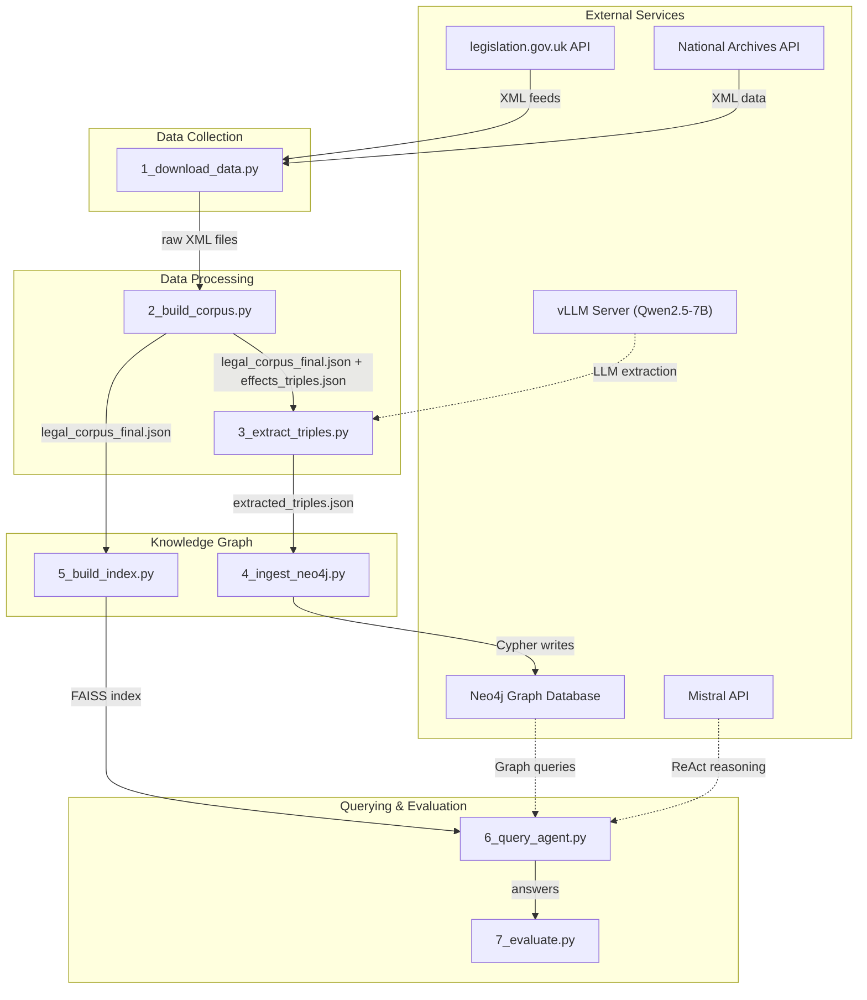

---

## 2. Module Map

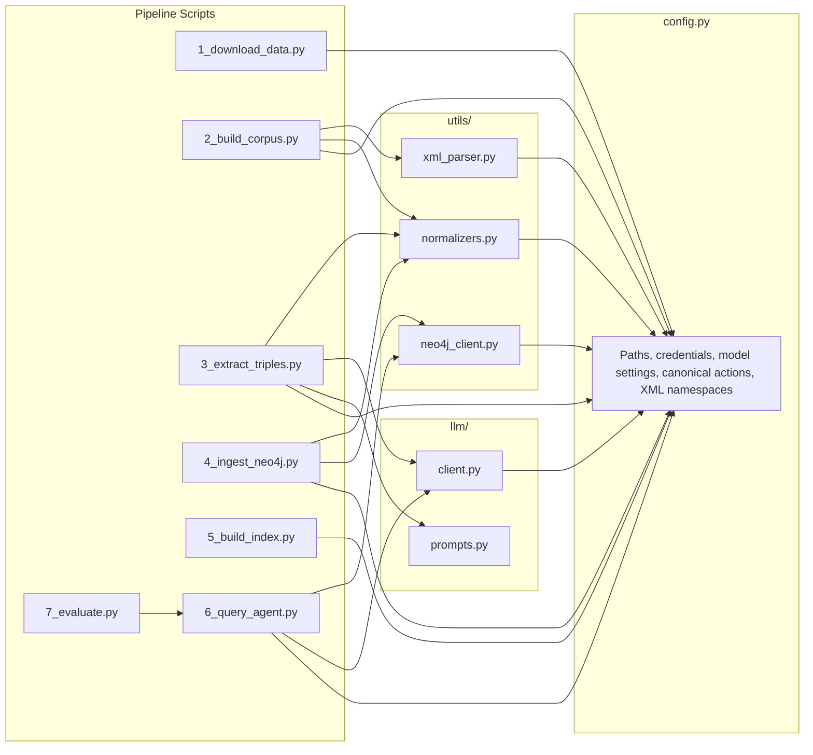

| File | Location | Purpose |
|------|----------|---------|
| [config.py](file:///home/suriya/Documents/ARU_AIML/PROJECT_app_ml/config.py) | Root | Centralized configuration — paths, credentials, model settings, canonical actions |
| [1_download_data.py](file:///home/suriya/Documents/ARU_AIML/PROJECT_app_ml/1_download_data.py) | Root | Async parallel downloader for UK legislation XML |
| [2_build_corpus.py](file:///home/suriya/Documents/ARU_AIML/PROJECT_app_ml/2_build_corpus.py) | Root | Orchestrates XML parsing into a unified JSON corpus |
| [3_extract_triples.py](file:///home/suriya/Documents/ARU_AIML/PROJECT_app_ml/3_extract_triples.py) | Root | LLM-based knowledge triple extraction with checkpointing |
| [4_ingest_neo4j.py](file:///home/suriya/Documents/ARU_AIML/PROJECT_app_ml/4_ingest_neo4j.py) | Root | Ingests triples into Neo4j with confidence accumulation |
| [5_build_index.py](file:///home/suriya/Documents/ARU_AIML/PROJECT_app_ml/5_build_index.py) | Root | Builds FAISS vector index from corpus embeddings |
| [6_query_agent.py](file:///home/suriya/Documents/ARU_AIML/PROJECT_app_ml/6_query_agent.py) | Root | Hybrid GraphRAG ReAct agent (FAISS + Neo4j + Mistral) |
| [7_evaluate.py](file:///home/suriya/Documents/ARU_AIML/PROJECT_app_ml/7_evaluate.py) | Root | Runs test questions and scores the agent's accuracy |
| [xml_parser.py](file:///home/suriya/Documents/ARU_AIML/PROJECT_app_ml/utils/xml_parser.py) | utils/ | All XML parsers — legislation, case law, effects, notes |
| [normalizers.py](file:///home/suriya/Documents/ARU_AIML/PROJECT_app_ml/utils/normalizers.py) | utils/ | Action & citation normalization, abbreviation expansion |
| [neo4j_client.py](file:///home/suriya/Documents/ARU_AIML/PROJECT_app_ml/utils/neo4j_client.py) | utils/ | Neo4j connection management and schema queries |
| [client.py](file:///home/suriya/Documents/ARU_AIML/PROJECT_app_ml/llm/client.py) | llm/ | LLM client wrappers (vLLM + Mistral) and JSON parsing |
| [prompts.py](file:///home/suriya/Documents/ARU_AIML/PROJECT_app_ml/llm/prompts.py) | llm/ | System prompts for triple extraction |

---

## 3. Step 0: Configuration — [config.py](file:///home/suriya/Documents/ARU_AIML/PROJECT_app_ml/config.py)

> **206 lines** · Single source of truth for the entire pipeline.

### Configuration Sections

| Section | Key Constants | Description |
|---------|--------------|-------------|
| **Data Paths** | `DATA_DIR`, `RAW_LEGISLATION_DIR`, `CORPUS_FILE`, `TRIPLES_FILE`, `INDEX_DIR` | All file paths for input/output data |
| **Neo4j** | `NEO4J_URI`, `NEO4J_USER`, `NEO4J_PASSWORD` | Graph DB connection (env-overridable) |
| **vLLM** | `VLLM_BASE_URL`, `VLLM_MODEL` | Local LLM server for extraction (Qwen2.5-7B-Instruct) |
| **Mistral** | `MISTRAL_API_KEY`, `MISTRAL_MODEL` | Cloud LLM for query agent (mistral-large-latest) |
| **Embeddings** | `EMBED_MODEL`, `EMBED_DIM`, `EMBED_BATCH_SIZE` | Sentence-transformers config (all-MiniLM-L6-v2, 384 dims) |
| **Processing** | `NUM_WORKERS`, `BATCH_SIZE`, `SAVE_EVERY`, `MAX_RETRIES` | Parallelism and checkpointing controls |
| **Canonical Actions** | `CANONICAL_ACTIONS`, `ACTION_NORMALIZER` | 19 valid relationship types + exhaustive normalizer map |
| **Concepts** | `CONCEPTS` | Legal domain concept definitions for concept node creation |
| **XML Namespaces** | `LEG_NS`, `META_NS`, `DC_NS`, `AKN_NS`, `TNA_NS` | XML namespace URIs for legislation & case law parsing |

### Key Functions

| Function | Signature | Purpose |
|----------|-----------|---------|
| [is_caselaw](file:///home/suriya/Documents/ARU_AIML/PROJECT_app_ml/config.py#79-82) | [(id_str: str) → bool](file:///home/suriya/Documents/ARU_AIML/PROJECT_app_ml/1_download_data.py#665-747) | Checks if a chunk ID belongs to case law by prefix matching |

### Canonical Actions (19 total)

```
Legislative:  AMENDS, REPEALS, SUBSTITUTES, INSERTS, COMMENCES, REVOKES, APPLIES, CITES, OVERRULES
Semantic:     DEFINES, INTERPRETS, DELEGATES, IMPLEMENTS
Power:        CREATES, EMPOWERS, REQUIRES, PROHIBITS, EXTENDS
```

### `ACTION_NORMALIZER` — maps **~120+ LLM variations** to these 19 canonical forms. Examples:

```
"AMEND" → "AMENDS"     "REPEALED" → "REPEALS"     "REPLACE" → "SUBSTITUTES"
"OMIT" → "REPEALS"     "AUTHORISE" → "EMPOWERS"   "FOLLOWS" → "CITES"
```

---

## 4. Step 1: Download Data

### File: [1_download_data.py](file:///home/suriya/Documents/ARU_AIML/PROJECT_app_ml/1_download_data.py)

> **796 lines** · Async parallel downloader using `requests` + `ThreadPoolExecutor`.

### Flowchart

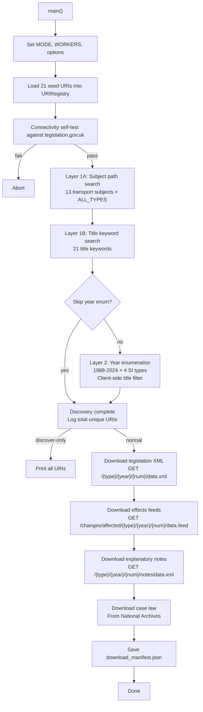

### Classes

#### [URIRegistry](file:///home/suriya/Documents/ARU_AIML/PROJECT_app_ml/1_download_data.py#174-204)
Deduplicated store of all discovered legislation URIs.

| Method | Description |
|--------|-------------|
| [add(item: dict)](file:///home/suriya/Documents/ARU_AIML/PROJECT_app_ml/1_download_data.py#180-184) | Add a URI entry (deduped by URI key) |
| [add_seed(leg_type, year, number, title)](file:///home/suriya/Documents/ARU_AIML/PROJECT_app_ml/1_download_data.py#185-189) | Add a seed URI |
| [items](file:///home/suriya/Documents/ARU_AIML/PROJECT_app_ml/1_download_data.py#190-193) | Property returning all stored items as list |
| [acts()](file:///home/suriya/Documents/ARU_AIML/PROJECT_app_ml/1_download_data.py#197-200) | Filter to primary legislation types |
| [sis()](file:///home/suriya/Documents/ARU_AIML/PROJECT_app_ml/1_download_data.py#201-204) | Filter to secondary legislation types |

**Item data format stored in the registry:**
```json
{
  "uri":    "/ukpga/2024/3",
  "title":  "Automated Vehicles Act 2024",
  "type":   "ukpga",
  "year":   2024,
  "number": 3
}
```

#### [AsyncClient](file:///home/suriya/Documents/ARU_AIML/PROJECT_app_ml/1_download_data.py#276-342)
Drop-in async HTTP client using `requests.Session` inside a `ThreadPoolExecutor`.

| Method | Description |
|--------|-------------|
| [__aenter__](file:///home/suriya/Documents/ARU_AIML/PROJECT_app_ml/1_download_data.py#289-294) / [__aexit__](file:///home/suriya/Documents/ARU_AIML/PROJECT_app_ml/1_download_data.py#295-300) | Context manager — sets up session with retry policy |
| [_make_session()](file:///home/suriya/Documents/ARU_AIML/PROJECT_app_ml/1_download_data.py#301-320) | Builds `requests.Session` with retry on 429/436/500-504 |
| [_sync_get(url)](file:///home/suriya/Documents/ARU_AIML/PROJECT_app_ml/1_download_data.py#321-336) | Synchronous GET with 0.4s throttle delay |
| [get_bytes(url)](file:///home/suriya/Documents/ARU_AIML/PROJECT_app_ml/1_download_data.py#337-342) | Async wrapper → runs sync GET in thread pool |

### Functions

| Function | Purpose | Input | Output |
|----------|---------|-------|--------|
| [parse_atom_feed(xml_bytes)](file:///home/suriya/Documents/ARU_AIML/PROJECT_app_ml/1_download_data.py#211-267) | Parse Atom feed XML from legislation.gov.uk | Raw XML bytes | [(entries_list, next_url_or_None)](file:///home/suriya/Documents/ARU_AIML/PROJECT_app_ml/1_download_data.py#665-747) |
| [_exhaust_feed(client, url, registry, ...)](file:///home/suriya/Documents/ARU_AIML/PROJECT_app_ml/1_download_data.py#348-373) | Follow paginated Atom feed to exhaustion | Initial URL, registry | Count of new items added |
| [discover_by_subject(client, registry, fast)](file:///home/suriya/Documents/ARU_AIML/PROJECT_app_ml/1_download_data.py#375-393) | Layer 1A: Search by 13 transport subject slugs | Client, registry | Populates registry in-place |
| [discover_by_title(client, registry, fast)](file:///home/suriya/Documents/ARU_AIML/PROJECT_app_ml/1_download_data.py#395-414) | Layer 1B: Search by 21 title keywords | Client, registry | Populates registry in-place |
| [discover_by_year_enum(client, registry, ...)](file:///home/suriya/Documents/ARU_AIML/PROJECT_app_ml/1_download_data.py#416-464) | Layer 2: Enumerate years × SI types, filter by title regex | Client, registry | Populates registry in-place |
| [download_legislation(client, registry)](file:///home/suriya/Documents/ARU_AIML/PROJECT_app_ml/1_download_data.py#480-511) | Download primary XML for all items | Client, registry | Count of downloads |
| [download_effects(client, registry)](file:///home/suriya/Documents/ARU_AIML/PROJECT_app_ml/1_download_data.py#513-546) | Download effects/changes feeds | Client, registry | Count of downloads |
| [download_notes(client, registry)](file:///home/suriya/Documents/ARU_AIML/PROJECT_app_ml/1_download_data.py#548-586) | Download explanatory notes (Acts only) | Client, registry | Count of downloads |
| [download_case_law(client, courts, years, ...)](file:///home/suriya/Documents/ARU_AIML/PROJECT_app_ml/1_download_data.py#588-628) | Download case law from National Archives | Client, options | Count of downloads |
| [save_manifest(registry, stats, elapsed)](file:///home/suriya/Documents/ARU_AIML/PROJECT_app_ml/1_download_data.py#634-659) | Write download manifest JSON | Registry + stats | `download_manifest.json` |
| [run(args)](file:///home/suriya/Documents/ARU_AIML/PROJECT_app_ml/1_download_data.py#665-747) | Main async entry point | CLI args | Runs full pipeline |
| [main()](file:///home/suriya/Documents/ARU_AIML/PROJECT_app_ml/2_build_corpus.py#29-74) | Colab-friendly entry point, configures mode | None | Calls [run()](file:///home/suriya/Documents/ARU_AIML/PROJECT_app_ml/1_download_data.py#665-747) |

### Output Data Structure — `download_manifest.json`

```json
{
  "download_time": "2024-03-17T18:26:05",
  "domain": "UK Transportation Law",
  "api_version": "v3 (Official OpenAPI)",
  "elapsed_seconds": 1234.5,
  "discovery_layers": ["subject_path_search", "title_keyword_search", "year_enumeration", "seed_fallback"],
  "stats": { "legislation": 150, "effects": 120, "notes": 30, "cases": 90 },
  "total_uris": 300,
  "acts_count": 80,
  "sis_count": 220,
  "items": [
    { "uri": "/ukpga/2024/3", "title": "Automated Vehicles Act 2024", "type": "ukpga", "year": 2024, "number": 3 }
  ]
}
```

### Output Files/Directories

| Path | Format | Content |
|------|--------|---------|
| `data/raw_legislation/*.xml` | CLML XML | Primary legislation (Acts) |
| `data/raw_statutory_instruments/*.xml` | CLML XML | Statutory Instruments |
| `data/raw_caselaw/*.xml` | AKN XML | Case law judgments |
| `data/amendments/*.xml` | Atom XML | Effects/changes feeds |
| `data/explanatory_notes/*.xml` | CLML XML | Explanatory notes |
| [data/download_manifest.json](file:///home/suriya/Documents/ARU_AIML/PROJECT_app_ml/data/download_manifest.json) | JSON | Download metadata |

---

## 5. Step 2: Build Corpus

### File: [2_build_corpus.py](file:///home/suriya/Documents/ARU_AIML/PROJECT_app_ml/2_build_corpus.py)

> **78 lines** · Orchestrates XML parsing via utility modules.

### Flowchart

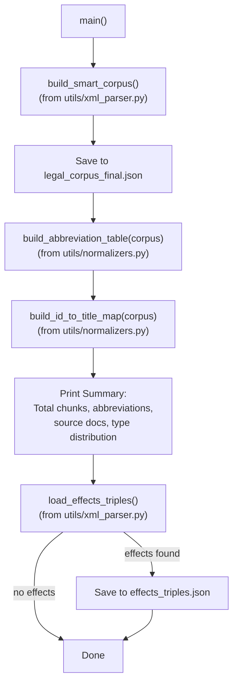

### Function: [main()](file:///home/suriya/Documents/ARU_AIML/PROJECT_app_ml/2_build_corpus.py#29-74)

The script is a thin orchestrator. All heavy lifting is delegated to utility modules:

1. **[build_smart_corpus()](file:///home/suriya/Documents/ARU_AIML/PROJECT_app_ml/utils/xml_parser.py#530-609)** — Parses all XML across 4 directories (legislation, SI, caselaw, notes) → returns `list[dict]` of chunks
2. **[build_abbreviation_table(corpus)](file:///home/suriya/Documents/ARU_AIML/PROJECT_app_ml/utils/normalizers.py#83-113)** — Extracts abbreviation mappings from corpus text
3. **[build_id_to_title_map(corpus)](file:///home/suriya/Documents/ARU_AIML/PROJECT_app_ml/utils/normalizers.py#115-124)** — Maps chunk ID prefixes to document titles
4. **[load_effects_triples()](file:///home/suriya/Documents/ARU_AIML/PROJECT_app_ml/utils/xml_parser.py#611-628)** — Parses all effects XML into ground-truth triples

### Input → Output

| Input | Output |
|-------|--------|
| `data/raw_legislation/*.xml` | [data/legal_corpus_final.json](file:///home/suriya/Documents/ARU_AIML/PROJECT_app_ml/data/legal_corpus_final.json) |
| `data/raw_caselaw/*.xml` | `data/effects_triples.json` |
| `data/raw_statutory_instruments/*.xml` | *(metadata printed to console)* |
| `data/explanatory_notes/*.xml` | |
| `data/amendments/*.xml` | |

### Data Format — `legal_corpus_final.json` (Corpus Chunk)

Each chunk represents one section/paragraph of a legal document:

```json
{
  "id":                "ukpga_2024_3.xml_1",
  "source":            "legislation",
  "doc_title":         "Automated Vehicles Act 2024",
  "year":              "2024",
  "section":           "1",
  "part":              "Part 1 — Automated vehicles",
  "heading":           "Meaning of 'self-driving'",
  "extent":            "E+W+S+NI",
  "in_force_date":     "2024-05-20",
  "internal_refs":     ["section 3", "section 5"],
  "inline_amendments": ["for 'word X' substitute 'word Y'"],
  "defined_terms":     {"the 2018 Act": "Automated and Electric Vehicles Act 2018"},
  "notes_text":        "This section defines the concept of self-driving...",
  "content":           "ACT: Automated Vehicles Act 2024 (2024) | SECTION: 1 | PART: Part 1 | HEADING: Meaning of 'self-driving' | TEXT: ..."
}
```

For case law chunks, the format adds `court_level` and uses prefix `CASE: ... | COURT: ... | PARA: ...`.

### Data Format — `effects_triples.json` (Ground-Truth Triple)

```json
{
  "source_id":        "effects_Railways Act 2005",
  "source_title":     "Railways Act 2005",
  "source_section":   "s. 12(1)",
  "action":           "SUBSTITUTES",
  "target_citation":  "Transport Act 2000 s. 5(1)",
  "target_act_name":  "Transport Act 2000",
  "detail_text":      "words substituted by Railways Act 2005 s. 12(1)",
  "effective_date":   "2024-01-01",
  "confidence":       1.0,
  "provenance":       "effects_api"
}
```

---

## 6. Step 3: Extract Triples

### File: [3_extract_triples.py](file:///home/suriya/Documents/ARU_AIML/PROJECT_app_ml/3_extract_triples.py)

> **362 lines** · LLM-based triple extraction with parallel workers and checkpointing.

### Flowchart

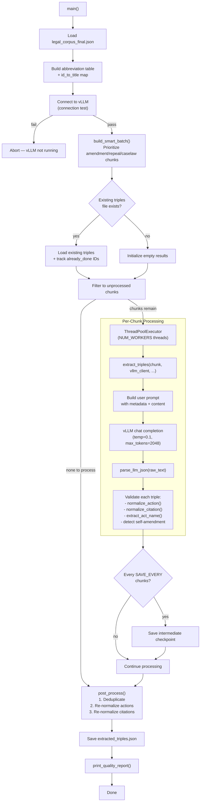

### Functions

| Function | Signature | Purpose |
|----------|-----------|---------|
| [extract_triples](file:///home/suriya/Documents/ARU_AIML/PROJECT_app_ml/3_extract_triples.py#43-151) | [(chunk, vllm_client, abbrev_table, id_to_title, max_retries) → list[dict]](file:///home/suriya/Documents/ARU_AIML/PROJECT_app_ml/1_download_data.py#665-747) | Core extraction: sends one corpus chunk to vLLM, parses JSON response, validates and normalizes each triple |
| [build_smart_batch](file:///home/suriya/Documents/ARU_AIML/PROJECT_app_ml/3_extract_triples.py#157-181) | [(corpus, batch_size) → list[int]](file:///home/suriya/Documents/ARU_AIML/PROJECT_app_ml/1_download_data.py#665-747) | Selects diverse chunk indices — prioritizes repeal-heavy, amendment-heavy, and caselaw chunks |
| [post_process](file:///home/suriya/Documents/ARU_AIML/PROJECT_app_ml/3_extract_triples.py#187-222) | [(triples, abbrev_table) → list[dict]](file:///home/suriya/Documents/ARU_AIML/PROJECT_app_ml/1_download_data.py#665-747) | Deduplicates, re-normalizes actions and citations |
| [print_quality_report](file:///home/suriya/Documents/ARU_AIML/PROJECT_app_ml/3_extract_triples.py#224-244) | [(triples) → None](file:///home/suriya/Documents/ARU_AIML/PROJECT_app_ml/1_download_data.py#665-747) | Prints action distribution, self-amendment stats, coverage stats |

### [extract_triples()](file:///home/suriya/Documents/ARU_AIML/PROJECT_app_ml/3_extract_triples.py#43-151) — Detailed Flow

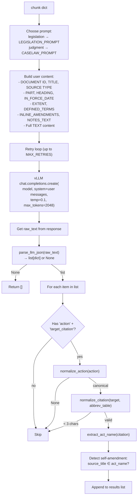

### LLM-Extracted Triple Format

The vLLM returns a JSON array where each item is:

```json
{
  "action":           "AMENDS",
  "target_citation":  "Road Traffic Act 1988 s.5",
  "detail_text":      "for 'prescribed limit' substitute 'specified limit'",
  "effective_date":   "2024-01-01"
}
```

After normalization and enrichment, the stored triple becomes:

```json
{
  "action":              "AMENDS",
  "target_citation":     "Road Traffic Act 1988 s.5",
  "target_act_name":     "Road Traffic Act 1988",
  "detail_text":         "for 'prescribed limit' substitute 'specified limit'",
  "effective_date":      "2024-01-01",
  "source_id":           "ukpga_2024_3.xml_1",
  "source_title":        "Automated Vehicles Act 2024",
  "source_section":      "1",
  "in_force_date":       "2024-05-20",
  "extent":              "E+W+S+NI",
  "is_self_amendment":   false,
  "chunk_id":            "ukpga_2024_3.xml_1"
}
```

---

## 7. Step 4: Ingest into Neo4j

### File: [4_ingest_neo4j.py](file:///home/suriya/Documents/ARU_AIML/PROJECT_app_ml/4_ingest_neo4j.py)

> **314 lines** · Ingests extracted + effects triples into Neo4j with confidence accumulation.

### Flowchart

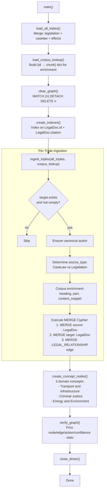

### Functions

| Function | Signature | Purpose |
|----------|-----------|---------|
| [load_all_triples](file:///home/suriya/Documents/ARU_AIML/PROJECT_app_ml/4_ingest_neo4j.py#41-70) | [() → list[dict]](file:///home/suriya/Documents/ARU_AIML/PROJECT_app_ml/1_download_data.py#665-747) | Merges legislation, caselaw, and effects triples from JSON files |
| [load_corpus_lookup](file:///home/suriya/Documents/ARU_AIML/PROJECT_app_ml/4_ingest_neo4j.py#72-83) | [() → dict](file:///home/suriya/Documents/ARU_AIML/PROJECT_app_ml/1_download_data.py#665-747) | Loads corpus into a `{chunk_id → chunk}` lookup dict |
| [ingest_triples](file:///home/suriya/Documents/ARU_AIML/PROJECT_app_ml/4_ingest_neo4j.py#89-191) | [(all_triples, corpus_lookup) → None](file:///home/suriya/Documents/ARU_AIML/PROJECT_app_ml/1_download_data.py#665-747) | Core ingestion with Cypher MERGE |
| [create_concept_nodes](file:///home/suriya/Documents/ARU_AIML/PROJECT_app_ml/4_ingest_neo4j.py#197-227) | [() → None](file:///home/suriya/Documents/ARU_AIML/PROJECT_app_ml/1_download_data.py#665-747) | Creates `:Concept` nodes and links `:LegalDoc` → `:Concept` via `:REGULATES` |
| [verify_graph](file:///home/suriya/Documents/ARU_AIML/PROJECT_app_ml/4_ingest_neo4j.py#233-276) | [() → None](file:///home/suriya/Documents/ARU_AIML/PROJECT_app_ml/1_download_data.py#665-747) | Prints graph statistics |

### Neo4j Schema

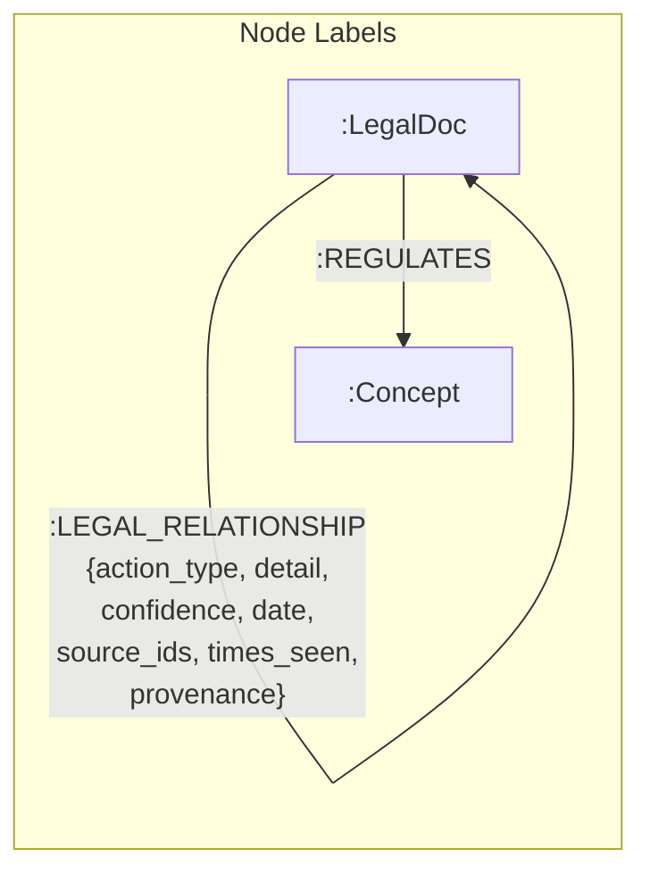

**`:LegalDoc` node properties:**

| Property | Type | Source |
|----------|------|--------|
| [id](file:///home/suriya/Documents/ARU_AIML/PROJECT_app_ml/utils/normalizers.py#115-124) | string | Chunk ID (e.g., `ukpga_2024_3.xml_1`) |
| [type](file:///home/suriya/Documents/ARU_AIML/PROJECT_app_ml/utils/xml_parser.py#437-470) | string | `"Legislation"` or `"CaseLaw"` |
| [title](file:///home/suriya/Documents/ARU_AIML/PROJECT_app_ml/1_download_data.py#395-414) | string | Document title |
| [citation](file:///home/suriya/Documents/ARU_AIML/PROJECT_app_ml/utils/normalizers.py#28-62) | string | Target citation (e.g., `Road Traffic Act 1988 s.5`) |
| [act_name](file:///home/suriya/Documents/ARU_AIML/PROJECT_app_ml/utils/normalizers.py#64-81) | string | Act name without section ref |
| `heading` | string | Section heading from corpus |
| `part` | string | Part/Pblock title from corpus |
| `content_snippet` | string | First 500 chars of content |

**`:LEGAL_RELATIONSHIP` edge properties:**

| Property | Type | Description |
|----------|------|-------------|
| `action_type` | string | One of 19 canonical actions |
| `detail` | string | Detail text (e.g., textual substitution wording) |
| `confidence` | float | Accumulated confidence (1.0 for API ground-truth) |
| `date` | string | Effective date (YYYY-MM-DD) |
| `source_ids` | list | All chunk IDs that contributed this edge |
| `times_seen` | int | How many times this edge was extracted |
| `provenance` | string | `"llm_extracted"` or `"effects_api"` |

### Confidence Accumulation Formula

When the same edge is seen multiple times, confidence is accumulated using the **noisy-OR** formula (from MedKGent):

```
r.confidence = 1.0 - (1.0 - r.confidence) * (1.0 - new_confidence)
```

This ensures confidence monotonically increases toward 1.0 with each supporting observation.

---

## 8. Step 5: Build FAISS Index

### File: [5_build_index.py](file:///home/suriya/Documents/ARU_AIML/PROJECT_app_ml/5_build_index.py)

> **104 lines** · Generates sentence embeddings and builds a FAISS vector index.

### Flowchart

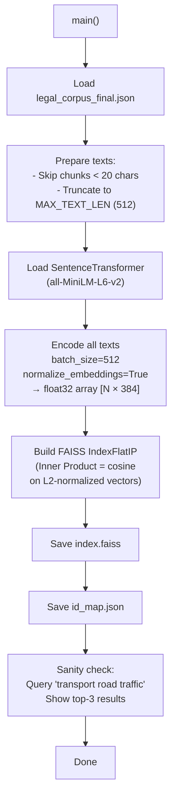

### Input → Output

| Input | Output |
|-------|--------|
| [data/legal_corpus_final.json](file:///home/suriya/Documents/ARU_AIML/PROJECT_app_ml/data/legal_corpus_final.json) | `data/faiss_index/index.faiss` |
| | `data/faiss_index/id_map.json` |

### FAISS ID Map Entry Format

```json
{
  "node_id":   "ukpga_2024_3.xml_1",
  "doc_title": "Automated Vehicles Act 2024",
  "section":   "1",
  "source":    "legislation",
  "text":      "ACT: Automated Vehicles Act 2024... [first 600 chars]"
}
```

### Embedding Parameters

| Parameter | Value | Description |
|-----------|-------|-------------|
| Model | `all-MiniLM-L6-v2` | Sentence-transformers model |
| Dimension | 384 | Embedding vector dimension |
| Batch Size | 512 | Encoding batch size |
| Max Text Length | 512 | Input text truncation |
| Index Type | `IndexFlatIP` | Inner Product (cosine on normalized vectors) |

---

## 9. Step 6: Query Agent

### File: [6_query_agent.py](file:///home/suriya/Documents/ARU_AIML/PROJECT_app_ml/6_query_agent.py)

> **477 lines** · Hybrid GraphRAG ReAct agent with 3 tools and anti-hallucination guardrails.

### Flowchart

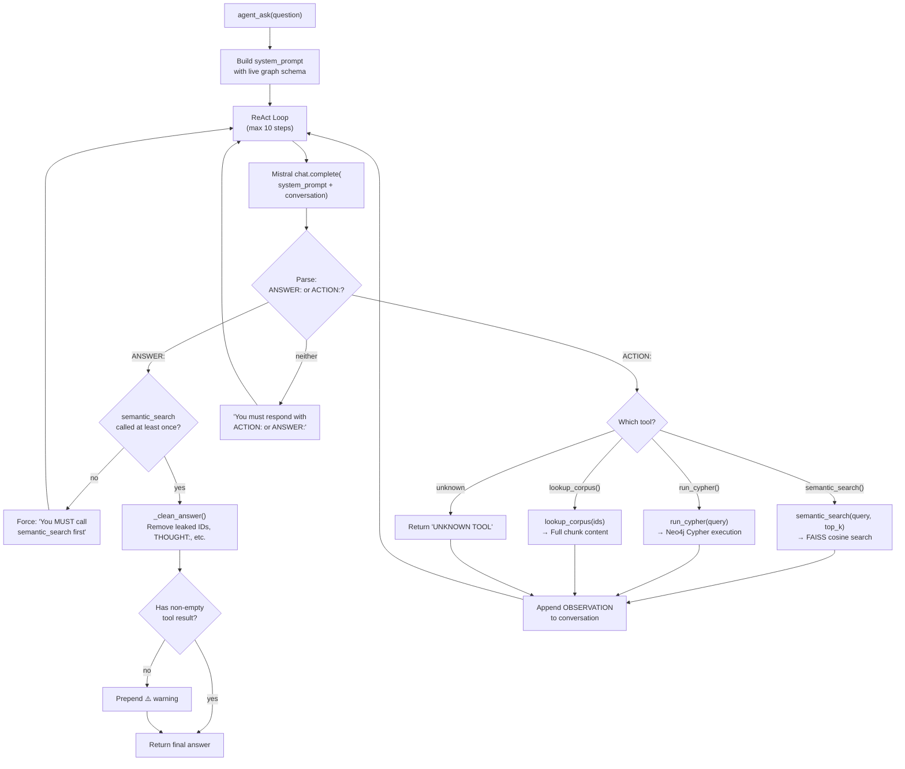

### Initialization: [_init()](file:///home/suriya/Documents/ARU_AIML/PROJECT_app_ml/6_query_agent.py#46-87)


### The Three Tools

#### Tool 1: [semantic_search(query, top_k=5)](file:///home/suriya/Documents/ARU_AIML/PROJECT_app_ml/6_query_agent.py#93-131)

| Aspect | Detail |
|--------|--------|
| **What it does** | Encodes query → searches FAISS → returns top-k matches above similarity threshold |
| **Input** | Query string, `top_k` (default 5) |
| **Output** | JSON array of matches with `node_id`, `doc_title`, `section`, `heading`, `part`, `similarity`, `snippet` |
| **Threshold** | `MIN_SIM_THRESHOLD = 0.25` — below this = "no match" |
| **Guard** | Returns `⚠️ NO_MATCHES` warning if nothing above threshold |

**Return format:**
```json
[
  {
    "node_id":    "ukpga_2024_3.xml_1",
    "doc_title":  "Automated Vehicles Act 2024",
    "section":    "1",
    "heading":    "Meaning of 'self-driving'",
    "part":       "Part 1 — Automated vehicles",
    "similarity": 0.8234,
    "snippet":    "ACT: Automated Vehicles Act 2024..."
  }
]
```

#### Tool 2: [run_cypher(query)](file:///home/suriya/Documents/ARU_AIML/PROJECT_app_ml/6_query_agent.py#137-161)

| Aspect | Detail |
|--------|--------|
| **What it does** | Executes arbitrary Cypher against Neo4j |
| **Input** | Cypher query string |
| **Output** | JSON array of result records, or error/warning string |
| **Guard** | Returns `⚠️ ZERO_RESULTS` if query matches nothing |

#### Tool 3: [lookup_corpus(node_ids_str)](file:///home/suriya/Documents/ARU_AIML/PROJECT_app_ml/6_query_agent.py#167-201)

| Aspect | Detail |
|--------|--------|
| **What it does** | Retrieves full content for given node IDs (up to 10) |
| **Input** | Comma-separated node IDs string |
| **Output** | JSON array of chunks with `node_id`, `doc_title`, `section`, `heading`, `part`, `content` (800 chars) |
| **Guard** | Returns `⚠️ NO_CONTENT_FOUND` if no IDs found |

### System Prompt Construction: [build_system_prompt()](file:///home/suriya/Documents/ARU_AIML/PROJECT_app_ml/6_query_agent.py#207-315)

The system prompt is built dynamically using live schema from Neo4j:

```
1. Tool definitions (semantic_search, run_cypher, lookup_corpus)
2. Current graph schema (node/edge counts, action types)
3. Legal domain concepts from :Concept nodes
4. Sample Cypher patterns
5. Output formatting rules — never expose raw IDs
6. Handling incomplete data — state clearly when data is missing
7. Policy context synthesis — group by theme, explain practical impact
8. Absolute guardrails — never answer from general knowledge
```

### Helper Functions

| Function | Purpose |
|----------|---------|
| [_clean_answer(answer)](file:///home/suriya/Documents/ARU_AIML/PROJECT_app_ml/6_query_agent.py#321-330) | Removes leaked THOUGHT: blocks, internal IDs (e.g., `ukpga_2024_3.xml_1`), empty parentheses |
| [_extract_arg(action_line, tool_name)](file:///home/suriya/Documents/ARU_AIML/PROJECT_app_ml/6_query_agent.py#332-346) | Parses the first string argument from a tool call in the LLM's response |

---

## 10. Step 7: Evaluate

### File: [7_evaluate.py](file:///home/suriya/Documents/ARU_AIML/PROJECT_app_ml/7_evaluate.py)

> **148 lines** · Runs test questions, scores the agent, saves results.

### Flowchart

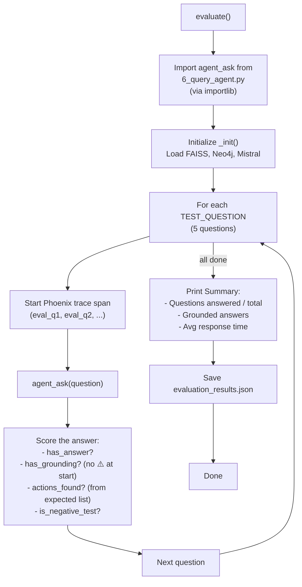

### Test Questions (5 total)

| # | Question | Domain | Expected Actions | Type |
|---|----------|--------|------------------|------|
| 1 | "Which 2023 Acts modify the Employment Rights Act 1996…?" | Employment | AMENDS, INSERTS, SUBSTITUTES, REPEALS | Positive |
| 2 | "What legislation regulates autonomous vehicles…?" | Transport | DEFINES, CREATES, REQUIRES | Positive |
| 3 | "What changes did the Finance Act 2023 make to dividend allowances?" | Finance | AMENDS, SUBSTITUTES | Positive |
| 4 | "What are the rules for cryptocurrency regulation under UK law?" | Crypto | *(none)* | **Negative** |
| 5 | "What safety requirements does the Automated Vehicles Act 2024 create?" | Transport | REQUIRES, CREATES, DEFINES | Positive |

### Scoring Criteria

| Metric | How Measured |
|--------|-------------|
| `has_answer` | Answer exists and doesn't start with `❌` |
| `has_grounding` | No `⚠️` in first 50 chars |
| `actions_found` | Count expected actions mentioned (case-insensitive) |
| `is_negative_test` | Question where expected_actions is empty — should trigger guardrail |
| `elapsed_seconds` | Wall-clock time per question |

### Output — `results/evaluation_results.json`

```json
[
  {
    "question":          "Which 2023 Acts modify the Employment Rights Act 1996...?",
    "domain":            "Employment",
    "answer_length":     1234,
    "elapsed_seconds":   15.3,
    "has_answer":        true,
    "has_grounding":     true,
    "expected_actions":  ["AMENDS", "INSERTS", "SUBSTITUTES", "REPEALS"],
    "actions_found":     ["AMENDS", "SUBSTITUTES"],
    "is_negative_test":  false,
    "error":             null
  }
]
```

---

## 11. Utility Modules

### 11.1 [utils/xml_parser.py](file:///home/suriya/Documents/ARU_AIML/PROJECT_app_ml/utils/xml_parser.py)

> **628 lines** · All XML parsing logic for the entire pipeline.

#### Functions

| Function | Lines | Input | Output | Purpose |
|----------|-------|-------|--------|---------|
| [_leg(tag)](file:///home/suriya/Documents/ARU_AIML/PROJECT_app_ml/utils/xml_parser.py#22-25) | 22-24 | Tag name | Namespaced tag | Prefix with legislation namespace |
| [_akn(tag)](file:///home/suriya/Documents/ARU_AIML/PROJECT_app_ml/utils/xml_parser.py#27-30) | 27-29 | Tag name | Namespaced tag | Prefix with AKN namespace |
| [_meta(tag)](file:///home/suriya/Documents/ARU_AIML/PROJECT_app_ml/utils/xml_parser.py#32-35) | 32-34 | Tag name | Namespaced tag | Prefix with metadata namespace |
| [extract_text_recursive(elem)](file:///home/suriya/Documents/ARU_AIML/PROJECT_app_ml/utils/xml_parser.py#41-51) | 41-50 | XML element | Plain text string | Recursively extract all text, strip tags |
| [extract_defined_terms(root)](file:///home/suriya/Documents/ARU_AIML/PROJECT_app_ml/utils/xml_parser.py#53-73) | 53-72 | XML root | `dict[short → full]` | Find `<Term>` definitions (e.g., "the Act" → full name) |
| [extract_internal_links(section_elem)](file:///home/suriya/Documents/ARU_AIML/PROJECT_app_ml/utils/xml_parser.py#75-83) | 75-82 | Section element | `list[str]` | Extract all `<InternalLink>` references |
| [extract_inline_amendments(section_elem)](file:///home/suriya/Documents/ARU_AIML/PROJECT_app_ml/utils/xml_parser.py#85-93) | 85-92 | Section element | `list[str]` | Extract all `<InlineAmendment>` text |
| [get_parent_pblock_title(elem, root)](file:///home/suriya/Documents/ARU_AIML/PROJECT_app_ml/utils/xml_parser.py#95-107) | 95-106 | Element + root | Part/Pblock title string | Walk up tree to find nearest `<Pblock>/<Part>` title |
| [parse_legislation_xml(filepath)](file:///home/suriya/Documents/ARU_AIML/PROJECT_app_ml/utils/xml_parser.py#113-252) | 113-251 | File path | `list[dict]` | Parse CLML legislation into smart chunks |
| [parse_caselaw_xml(filepath)](file:///home/suriya/Documents/ARU_AIML/PROJECT_app_ml/utils/xml_parser.py#258-343) | 258-342 | File path | `list[dict]` | Parse AKN case law into chunks |
| [parse_effects_xml(filepath)](file:///home/suriya/Documents/ARU_AIML/PROJECT_app_ml/utils/xml_parser.py#351-435) | 351-434 | File path | `list[dict]` | Parse effects feed into ground-truth triples |
| [_map_effect_type(effect_type)](file:///home/suriya/Documents/ARU_AIML/PROJECT_app_ml/utils/xml_parser.py#437-470) | 437-469 | Effect type string | Canonical action | Map API effect types to canonical actions |
| [parse_notes_xml(filepath)](file:///home/suriya/Documents/ARU_AIML/PROJECT_app_ml/utils/xml_parser.py#476-524) | 476-523 | File path | `dict[ref → text]` | Parse explanatory notes into section→commentary mapping |
| [build_smart_corpus(...)](file:///home/suriya/Documents/ARU_AIML/PROJECT_app_ml/utils/xml_parser.py#530-609) | 530-608 | Directory paths | `list[dict]` | Main orchestrator: parse all XML across 4 dirs + enrich with notes |
| [load_effects_triples(amendments_dir)](file:///home/suriya/Documents/ARU_AIML/PROJECT_app_ml/utils/xml_parser.py#611-628) | 611-627 | Directory path | `list[dict]` | Load all effects triples from amendments directory |

#### [parse_legislation_xml()](file:///home/suriya/Documents/ARU_AIML/PROJECT_app_ml/utils/xml_parser.py#113-252) — Detailed Flow

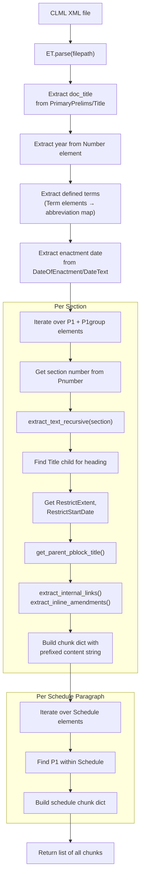

#### [build_smart_corpus()](file:///home/suriya/Documents/ARU_AIML/PROJECT_app_ml/utils/xml_parser.py#530-609) — Orchestrator Flow

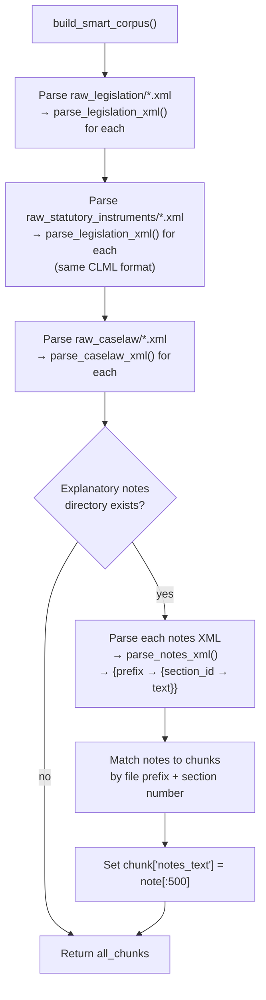

---

### 11.2 [utils/normalizers.py](file:///home/suriya/Documents/ARU_AIML/PROJECT_app_ml/utils/normalizers.py)

> **124 lines** · Action/citation normalization and abbreviation expansion.

| Function | Signature | Purpose |
|----------|-----------|---------|
| [normalize_action](file:///home/suriya/Documents/ARU_AIML/PROJECT_app_ml/utils/normalizers.py#12-26) | [(raw_action: str) → str \| None](file:///home/suriya/Documents/ARU_AIML/PROJECT_app_ml/1_download_data.py#665-747) | Maps any LLM action string to canonical form via `ACTION_NORMALIZER` dict, with fuzzy substring fallback |
| [normalize_citation](file:///home/suriya/Documents/ARU_AIML/PROJECT_app_ml/utils/normalizers.py#28-62) | [(raw_citation: str, abbrev_table?) → str \| None](file:///home/suriya/Documents/ARU_AIML/PROJECT_app_ml/1_download_data.py#665-747) | Expands abbreviations, standardizes section references (`section 5` → `s.5`, `Schedule 2` → `Sch.2`) |
| [extract_act_name](file:///home/suriya/Documents/ARU_AIML/PROJECT_app_ml/utils/normalizers.py#64-81) | [(citation: str) → str \| None](file:///home/suriya/Documents/ARU_AIML/PROJECT_app_ml/1_download_data.py#665-747) | Extracts just the Act name without section ref (`Housing Act 1996 s.122` → `Housing Act 1996`) |
| [build_abbreviation_table](file:///home/suriya/Documents/ARU_AIML/PROJECT_app_ml/utils/normalizers.py#83-113) | [(corpus: list[dict]) → dict](file:///home/suriya/Documents/ARU_AIML/PROJECT_app_ml/1_download_data.py#665-747) | Builds abbreviation map from [defined_terms](file:///home/suriya/Documents/ARU_AIML/PROJECT_app_ml/utils/xml_parser.py#53-73) in chunks + regex patterns in text |
| [build_id_to_title_map](file:///home/suriya/Documents/ARU_AIML/PROJECT_app_ml/utils/normalizers.py#115-124) | [(corpus: list[dict]) → dict](file:///home/suriya/Documents/ARU_AIML/PROJECT_app_ml/1_download_data.py#665-747) | Maps source ID prefixes to readable document titles |

#### [normalize_citation()](file:///home/suriya/Documents/ARU_AIML/PROJECT_app_ml/utils/normalizers.py#28-62) Flow

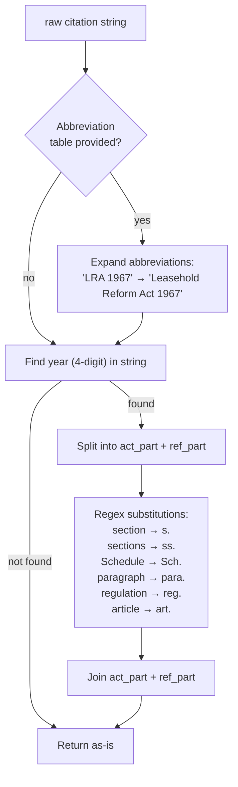

---

### 11.3 [utils/neo4j_client.py](file:///home/suriya/Documents/ARU_AIML/PROJECT_app_ml/utils/neo4j_client.py)

> **74 lines** · Neo4j connection management and schema queries.

| Function | Purpose |
|----------|---------|
| [get_driver()](file:///home/suriya/Documents/ARU_AIML/PROJECT_app_ml/utils/neo4j_client.py#13-21) | Return singleton Neo4j driver (creates on first call, verifies connectivity) |
| [close_driver()](file:///home/suriya/Documents/ARU_AIML/PROJECT_app_ml/utils/neo4j_client.py#23-30) | Close the driver and reset singleton |
| [clear_graph()](file:///home/suriya/Documents/ARU_AIML/PROJECT_app_ml/utils/neo4j_client.py#32-38) | Execute `MATCH (n) DETACH DELETE n` |
| [create_indexes()](file:///home/suriya/Documents/ARU_AIML/PROJECT_app_ml/utils/neo4j_client.py#40-47) | Create indexes on `LegalDoc.id` and `LegalDoc.citation` |
| [get_schema()](file:///home/suriya/Documents/ARU_AIML/PROJECT_app_ml/utils/neo4j_client.py#49-74) | Fetch live graph schema — returns node/edge counts, action type distribution, concept list, sample edges |

**[get_schema()](file:///home/suriya/Documents/ARU_AIML/PROJECT_app_ml/utils/neo4j_client.py#49-74) return format:**

```json
{
  "node_count":   1234,
  "edge_count":   5678,
  "action_types": { "AMENDS": 500, "CITES": 300, "SUBSTITUTES": 200 },
  "concepts":     ["Criminal Justice", "Energy and Environment", "Transport and Infrastructure"],
  "sample_edges": [
    { "source_id": "ukpga_2024_3.xml_1", "action": "AMENDS", "detail": "...", "target": "Road Traffic Act 1988 s.5" }
  ]
}
```

---

## 12. LLM Modules

### 12.1 [llm/client.py](file:///home/suriya/Documents/ARU_AIML/PROJECT_app_ml/llm/client.py)

> **71 lines** · LLM client wrappers and JSON response parsing.

| Function | Purpose |
|----------|---------|
| [get_vllm_client(timeout=120.0)](file:///home/suriya/Documents/ARU_AIML/PROJECT_app_ml/llm/client.py#12-25) | Creates an `OpenAI` client pointing at the local vLLM server. No retries (handled in extraction script). |
| [get_mistral_client()](file:///home/suriya/Documents/ARU_AIML/PROJECT_app_ml/llm/client.py#27-31) | Creates a `Mistral` client using API key from config. |
| [parse_llm_json(raw_text)](file:///home/suriya/Documents/ARU_AIML/PROJECT_app_ml/llm/client.py#33-71) | Robust JSON parser for LLM output — handles raw arrays, markdown code blocks, wrapped dicts, single objects. Returns `list[dict]` or `None`. |

#### [parse_llm_json()](file:///home/suriya/Documents/ARU_AIML/PROJECT_app_ml/llm/client.py#33-71) Flow

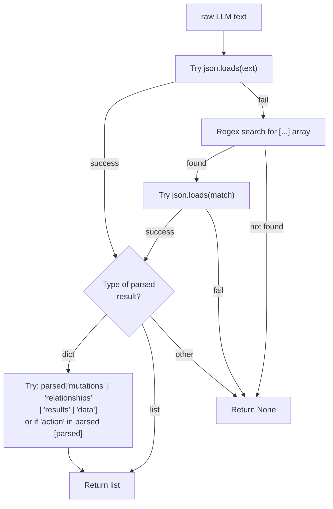

---

### 12.2 [llm/prompts.py](file:///home/suriya/Documents/ARU_AIML/PROJECT_app_ml/llm/prompts.py)

> **85 lines** · System prompts for triple extraction.

#### `LEGISLATION_PROMPT`

Used for extracting triples from Acts and Statutory Instruments. Defines:
- **19 relationship types** organized into 4 categories (Legislative Modification, Judicial, Semantic/Cross-Domain, Power & Obligation)
- **8 extraction rules** (use full citations, no abbreviations, capture dates, etc.)
- **Bad examples** to avoid (wrong tense, abbreviations, grouped targets)
- **Required output format:** JSON array of `{action, target_citation, detail_text, effective_date}`

#### `CASELAW_PROMPT`

Used for extracting triples from court judgments. Emphasizes:
- **Judicial actions** as most common: CITES, OVERRULES, INTERPRETS, APPLIES
- **Full citation rules** for both Acts and cases
- **Same output format** as legislation prompt

---

## 13. End-to-End Data Flow Summary

### Complete Data Transformation Pipeline

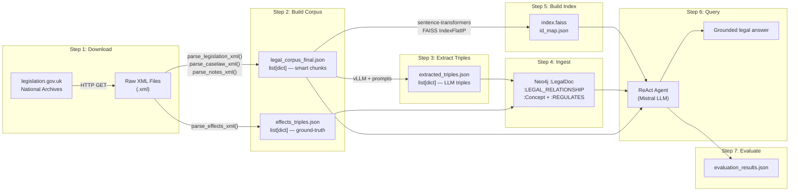

### Data Formats at Each Stage

| Stage | File | Format | Record Count (typical) | Key Fields |
|-------|------|--------|----------------------|------------|
| **Raw** | `*.xml` | XML (CLML/AKN/Atom) | 300+ files | Full XML structure |
| **Corpus** | `legal_corpus_final.json` | JSON array of chunks | 3000-5000 chunks | [id](file:///home/suriya/Documents/ARU_AIML/PROJECT_app_ml/utils/normalizers.py#115-124), `source`, `doc_title`, `section`, `content`, `heading`, `part`, [defined_terms](file:///home/suriya/Documents/ARU_AIML/PROJECT_app_ml/utils/xml_parser.py#53-73), `notes_text` |
| **Effects** | `effects_triples.json` | JSON array of triples | 500-2000 triples | `source_title`, [action](file:///home/suriya/Documents/ARU_AIML/PROJECT_app_ml/utils/normalizers.py#12-26), `target_citation`, `effective_date`, `confidence=1.0`, `provenance="effects_api"` |
| **LLM Triples** | `extracted_triples.json` | JSON array of triples | 2000-10000 triples | `source_id`, [action](file:///home/suriya/Documents/ARU_AIML/PROJECT_app_ml/utils/normalizers.py#12-26), `target_citation`, `detail_text`, `effective_date`, `is_self_amendment` |
| **FAISS Index** | `index.faiss` + `id_map.json` | Binary + JSON | N vectors × 384 dims | FAISS binary; `node_id`, `doc_title`, `section`, [text](file:///home/suriya/Documents/ARU_AIML/PROJECT_app_ml/utils/xml_parser.py#41-51) |
| **Neo4j** | Graph database | Property graph | ~1000-5000 nodes, ~5000-15000 edges | `:LegalDoc {id, citation, title}`, `:LEGAL_RELATIONSHIP {action_type, confidence}` |
| **Evaluation** | `evaluation_results.json` | JSON array | 5 results | `question`, `has_answer`, `has_grounding`, `actions_found`, `elapsed_seconds` |
